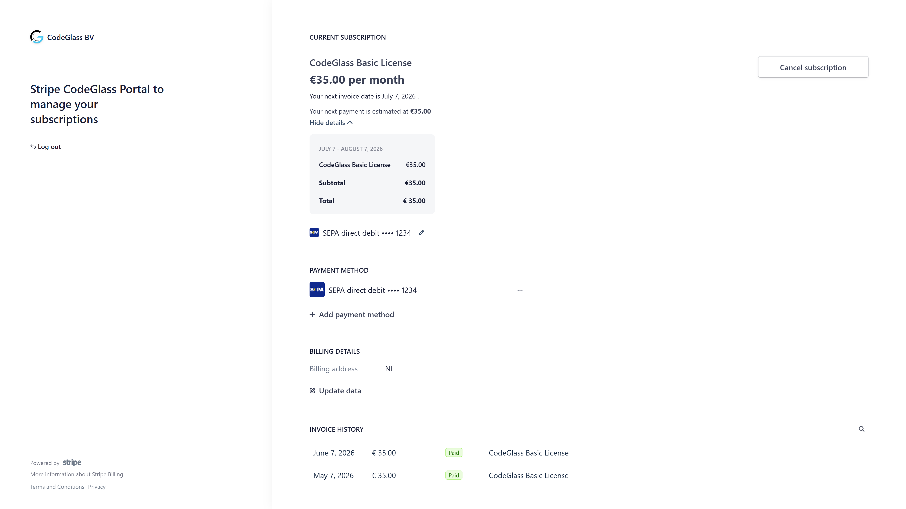
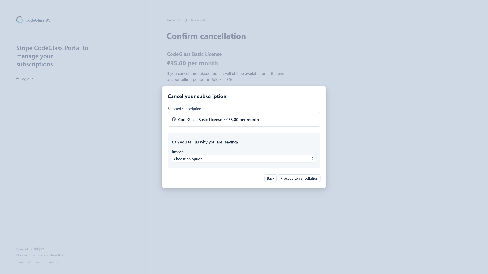
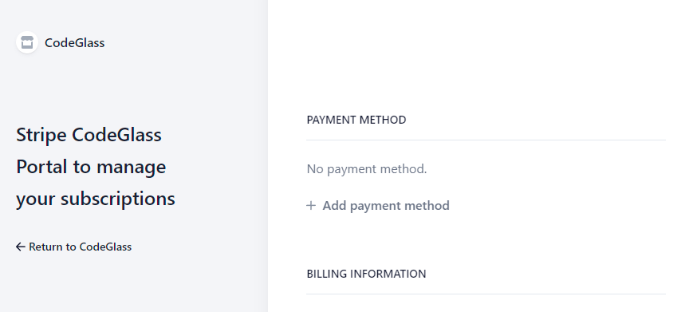

# Change or Cancel Subscription

## TL;DR

Visit [Licensespring](https://users.licensespring.com/login) to upgrade your subscription.  
If your subscription has expired or you never had one: [Buy Subscription](https://julia.codeglass.io/license)

## Learn More

You can update your subscription at any time to better suit your needs.

Subscription management is handled through your [Stripe CodeGlass Account](../account#stripe-codeglass-account).  
It uses the same email you use to [log in](../views/general/login) to CodeGlass.

To manage your billing, visit: [https://billing.stripe.com/p/login/14kg2Me9F7yu4GA144](https://billing.stripe.com/p/login/14kg2Me9F7yu4GA144)  
Here, you can request a login link by email.

You will be directed to a page that looks like this:

If available, you'll see a ["Cancel plan"](#cancel-plan) button.

If you don't see the button, see:

- [No Subscription](#no-subscription)

**All changes take effect immediately**, with prorated billing adjustments.

:::info
Remaining prorated credit is applied to your Stripe balance and used for future payments.
:::

### Cancel Plan

Use this screen to cancel or pause your subscription. You will retain access until the end of your billing term.

:::info
To reduce the number of licenses, use the Cancel Plan page instead.
:::

## FAQ

### No Access Button

If you don't see a button to access your subscription:
- Ensure you're using the correct email address.
- If you're not the [License Manager](license-portal.md#license-manager), you must contact the person who granted your license.

If you're unsure, feel free to [contact us](/contact).

### No Subscription

If you see this screen, your subscription is no longer active or never existed.

You can [purchase a new subscription](https://julia.codeglass.io/license)

Need help? [Contact us](/contact).
