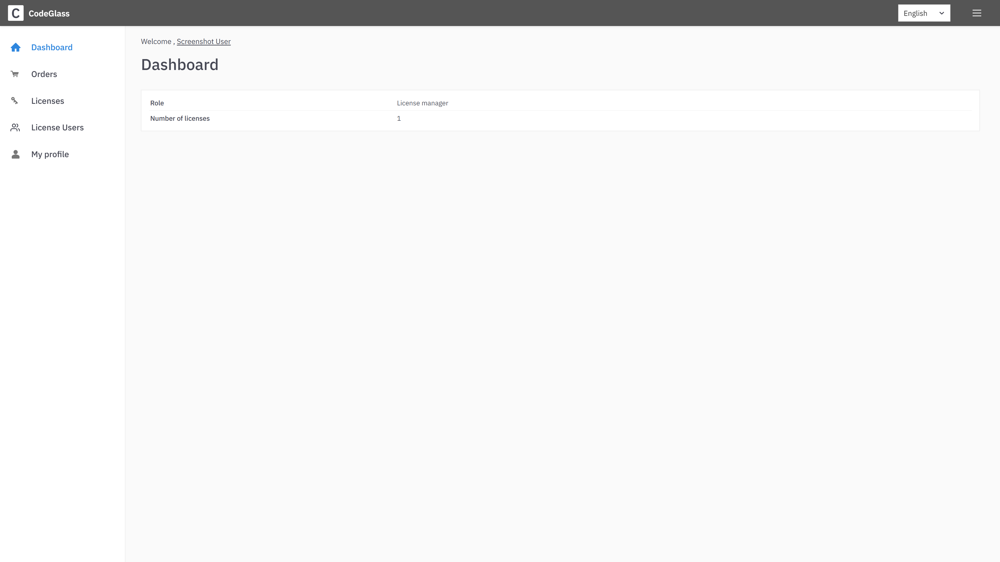
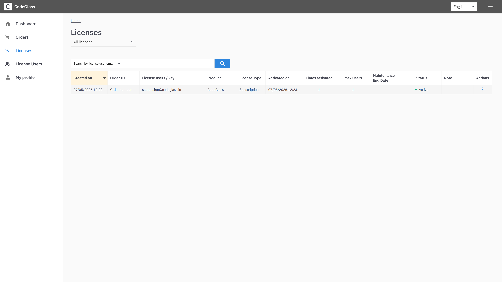
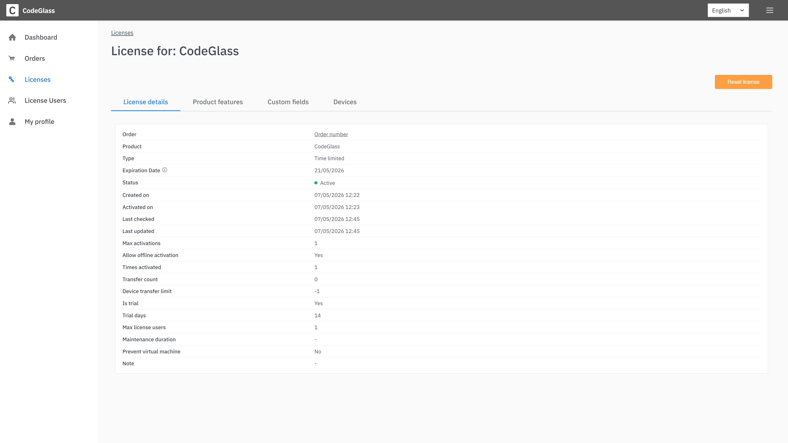
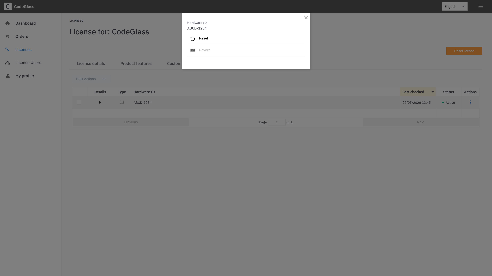
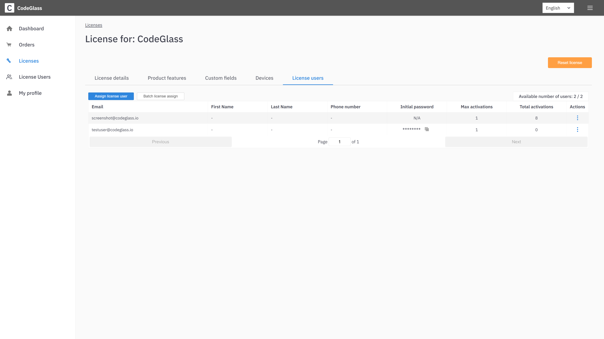

# License Portal

CodeGlass uses LicenseSpring as its license provider. Through the LicenseSpring end-user portal, you can manage your subscription and license activations.

This page explains how to use the portal effectively.

## Deactivate Devices

You may encounter a message in CodeGlass indicating your subscription is activated on too many devices.
> Only [License Managers](#license-manager) can deactivate devices. If deactivating doesn't work please [contact us](/contact).

To deactivate a device:
1. Navigate to your [License](#license).
2. Open the [Devices tab](#devices).
3. Click the 3 dots under Actions.
3. Use the reset button to deactivate a device.

If you have exceeded the allowed number of deactivations, you will no longer be able to reset devices yourself.  
In this case, [contact us](/contact) to reset your deactivation limit.

> If you find yourself frequently hitting the device limit, consider purchasing an additional subscription to enable concurrent usage on multiple machines.

## License Manager

You are granted the **License Manager** role if you are the owner of an Enterprise subscription.

License Managers can:
- Reset devices
- Assign and create user accounts for login via the [Users tab](#users)

## Portal Pages

### Login

Go to: [https://users.licensespring.com/login](https://users.licensespring.com/login)

You will see:

Use:
- **Company ID**: `CodeGlass`
- **Email & Password**: The same credentials used to [log in](../views/general/login) to CodeGlass

If you haven't logged in before, you can find these details in the welcome email from LicenseSpring when you obtained your subscription.

Upon login, you'll see the dashboard:

### Licenses

Navigate to: [https://users.licensespring.com/licenses](https://users.licensespring.com/licenses)

You should see your active subscription listed:

> You should only see **one entry** per account, even if you've purchased multiple licenses. If more appear, please [contact us](/contact).

### License

Clicking on a subscription shows:

If you are a [License Manager](#license-manager), you can use the **Reset License** button to clear device or user assignments.

### Devices

The **Devices** tab lists all machines activated under your subscription:

You can deactivate devices here to stay within your activation limit, by clicking on the three dots under "Actions".

### Users

Visible only to [License Managers](#license-manager):

On this page, you can:
- Create user accounts
- Assign users to your subscription

If you receive a “Max license users number reached” error, you must [upgrade your subscription](./change-subscription) to assign additional users.
