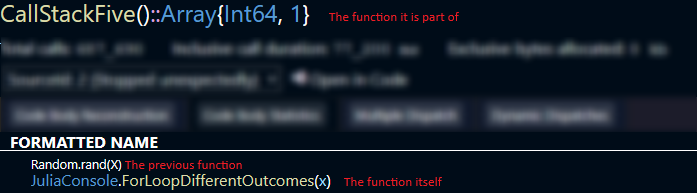

# Code Paths

A lot of the detail you see in CodeGlass comes from something called **code paths**.

Instead of only telling you that a function is slow, CodeGlass tries to show *where* inside that function things slow down. That is what code paths are used for.

A code path is built from three pieces:

- the function itself  
- the function that was called just before it  
- the function it belongs to

So it is not just “this function ran”, but more like “this function ran here, right after that other function, inside this parent”.

## A Simple Example

In the screenshot below (from the [code body statistics](../views/app-instance/codemember#code-body-statistics) view), we look at a function called `ForLoopDifferentOutcomes`.

Its code path looks like this:

- `ForLoopDifferentOutcomes` → the function itself  
- `rand` → the function that ran just before  
- `CallStackFive` → the parent function  



Whenever CodeGlass shows stats for a code path, it means it is tied to that exact situation.

## Same Function, Different Paths

Calling the same function twice does not always mean it is the same code path.

```julia
function parent_function()
    a()
    b()
    c()
    b()
end
```

Here, `b` is called twice. Both calls are inside `parent_function`, but:

- the first call happens after `a`  
- the second call happens after `c`  

That makes them two separate code paths.

## When Paths Look the Same

Sometimes different flows end up sharing the same code path.

```julia
function parent_function()
    a()
    if condition
        exponentially_scaling_function(10)
    else
        exponentially_scaling_function(10_000)
    end
end
```

Even though the work is very different, both calls:

- happen after `a`  
- belong to `parent_function`  

So CodeGlass treats them as the same code path and combines the stats.  
This can hide big differences, like one call being fast and the other being very slow.

## Dynamic Dispatch and Extra Paths

Julia can create multiple versions of a function depending on the types it sees.

```julia
function add_one(x::Real)
    return x + 1
end

add_one(1)
add_one(1.0)
```

This looks like only one function is called in this function, but in practice there may be multiple versions of `+` depending on the type of the value `x`.
In this case, Julia can decide to use a version of `+` that supports a float and an int.

As CodeGlass treats each of these as separate functions, this means you end up with more code paths than you expect.

This is also why the [code body reconstruction](../views/app-instance/codemember#code-body-reconstruction) is not a direct copy of your source code, but why it shows what actually ran.

## Time and Allocations Between Calls

CodeGlass measures time based on function calls. But not everything in your code is a function call.

```julia
function parent_function()
    a()
    x = Int64[]
    b()
end
```

The array allocation happens between `a` and `b`. Since it is not a function call, CodeGlass attaches that time and allocation to the next function, which is `b`.

So the code path for `b` includes:

- time spent after `a`  
- the allocation of the array  
- the execution of `b` itself  

## What Happens With Filters

If you have applied a [filter](./filters), the timings of the filtered function is also included in the code path, just like time spend between the calls.
If a function is filtered, CodeGlass doesn't know about it, and therefore cannot make a code path for it.
To fix this, those timings are included in the next functions code path.

```julia
function parent_function()
    a()
    filtered()
    b()
end
```

If `filtered` is hidden, its time is added to the next unfiltered function, which is `b`.

If `filtered` calls other functions that are not filtered, those still show up. They appear as if they happened directly between `a` and `b`.

This is similar to what happens when Julia inlines a function. The inlined function disappears, and its work is merged into the surrounding code.

## Return Code Paths

CodeGlass also tracks **return code paths**.

These are similar to normal code paths, but instead of pointing to a function, they point to a return.

They do not include timing data, because a return itself does not take time.

If you return a function call:

```julia
function parent_function()
    return a()
end
```


CodeGlass treats it like this:

``` julia
function parent_function()
    x = a()
    return x
end
```

So the call to `a` and the return are handled as separate steps.