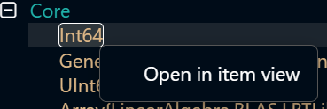
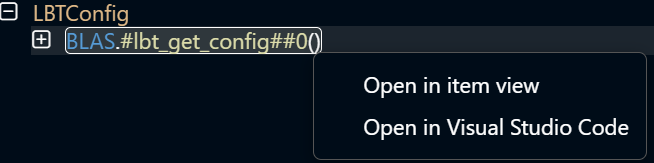
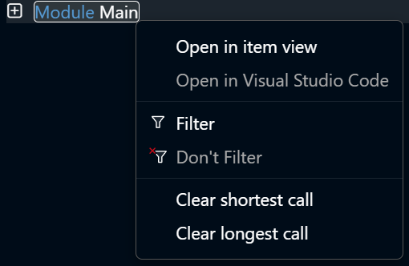

# Context Menus

In the [CodeGlass Client](../intro#client) there are a lot of places where [Code Members](../views/app-instance/codemember) and [Memory Objects](../views/app-instance/mem-object-allocator-statistics) are shown.
By right clicking these elements, you will open their context menu.

### Memory Object

Clicking the **Open in item view** button will open the [Memory Object](../views/app-instance/mem-object-allocator-statistics).

### Code Member / Module

Clicking the **Open in item view** button will open the [Code Member](../views/app-instance/codemember) or [Module](../views/app-instance/statistics).   
Clicking the **Open in Visual Studio Code** button will try to open VS Code and locate the Code Member.

### Statistics / Application Explorer

The context menus in the [statistics view](../views/app-instance/statistics) and [application explorer](../views/app-instance/application-explorer) also have the option to [filter](./filters) the Code Member or Module.   
In the statistics view it is even possible to clear the [longest and shortest call duration](../views/app-instance/statistics#types-of-statistics) of that Module or Code Member.

