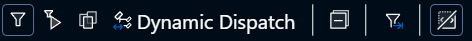

# Filters
:::info
The goal of filters is to allow the user to specify which functions CodeGlass should profile.
Filtering out a function means that it does not get any hooks, and therefore not get profiled. This has the benefit that it also does not get the tiny bit of CodeGlass overhead. 
For Julia this is not yet implemented, and filters therefore are only visual filters.
:::

:::info
Filtering in CodeGlass can be done in more advanced ways then described below, but these features are not yet available on the current version of the client. These advanced features will be added in an later update.
:::

When you are profiling a large application that uses a lot of external packages, you can quickly become overwhelmed by the amount of data CodeGlass shows. To solve this CodeGlass allows you to apply filters to your data. 

You can apply these filters by right clicking on any module or function in the [application explorer](../views/app-instance/application-explorer) or the [statistics table](../views/app-instance/statistics). This opens a context menu where you can choose to filter or remove the filter on an item.

## Toolbars
Many views and tables have a toolbar where you can choose between different filter options. The filter options on these views often look like the image below.

### Current Filters
These are the filters currently active on this instance. These are the [start filters](#start-filters) + all the filters you set through the context menu.

### Start Filters
These are the filters that were used to start the current instance. When an application starts, CodeGlass applies the **application filters** as **application instance start filters**. To make filters part of application filters, filter all the items the way that you like to store them, and then click on [apply application filters](#apply-to-application-filters).

### Show All
Clicking this shows all items regardless of filters. This can be useful when you are trying to remove a filter.

### Dynamic Dispatch
Clicking this only shows modules and functions that are dynamically dispatched in the code.

### Collapse All
Clicking this collapses all the expanded items.

### Apply to Application Filters
Clicking this takes the [current filters](#current-filters) and stores them as application filters. This is an overwriting functionality, meaning it overwrites the existing filters for the onces currently selected.

### Show/Hide uncalled functions
Clicking this switches between all the registered functions and all the functions that have been executed in the selected [data source](../concepts-and-features/datasources). Please note that this filter is applied in addition to the previously explained filters.