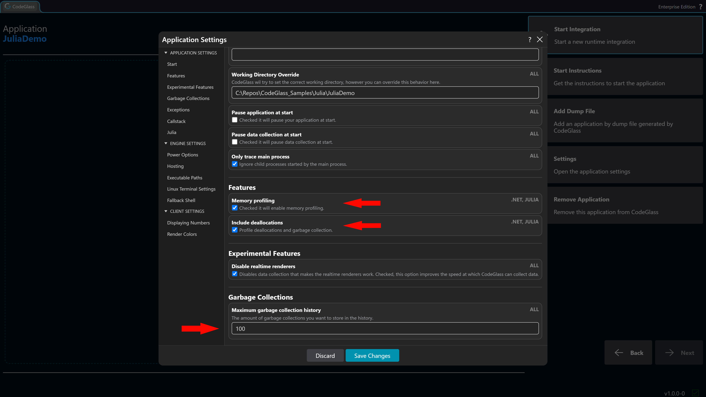
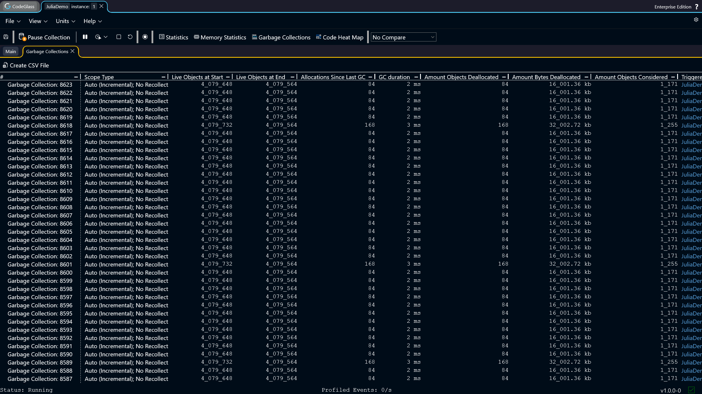
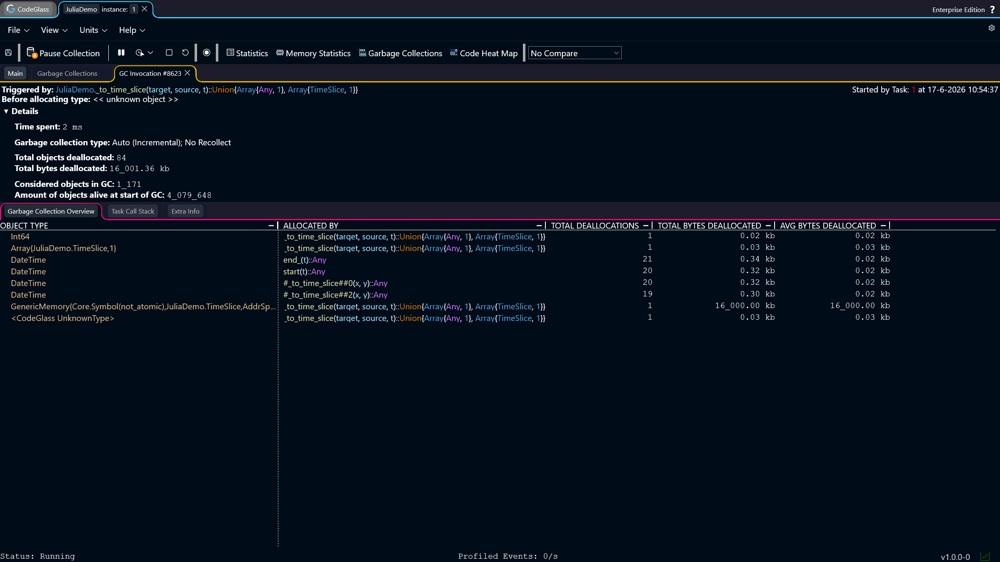
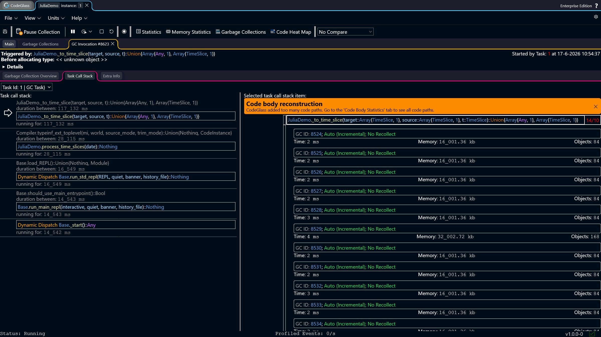
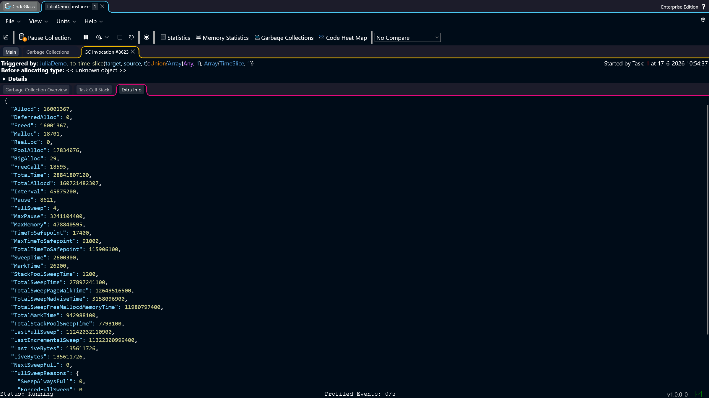

# Garbage Collection Profiling

This _How To_ covers the basics of garbage collection profiling using CodeGlass. Improving garbage collection performance can be challenging, which is why this is considered an advanced tutorial.

This post will go into:
- Recommended settings
- Example code
- How to use the views
- The solution for the example

:::info
This _How To_ assumes that you already have CodeGlass fully [setup](../../category/getting-started), and that you have already [created an application](../../views/general/application-list#add-application).
:::

## Recommended Settings

There are 3 settings that relate to the way CodeGlass tracks garbage collections.   

First of all, we have the [**Memory Profiling** setting](../../views/general/settings#memory-profiling). This setting needs to be enabled for garbage collection to be tracked.   

Next up is the [**Include Deallocations** setting](../../views/general/settings#include-deallocations). This setting is not needed to look at the garbage collections that occur in your application, but it greatly helps to find out how many and what objects got deallocated during the GC.   

Finally, we have the [**Maximum Garbage Collection History** setting](../../views/general/settings#maximum-garbage-collection-history). This setting tells CodeGlass how many garbage collections it should keep in its history. When you are actively looking at the profiling session, **100** should be more than enough. However, if you are running a large application to create a [dump file](../../concepts-and-features/dumpfiles), you might want to increase this number to something like **10_000**.




## Example Code

The example code used for this _How To_ is the same as in the [Typed Functions, Predictable Performance](./typed-functions-predictable-performance) _How To_. This code is an isolated snippet from a larger project. 

The issue we found here is that it triggers a large number of small garbage collections when certain values are used to call this code snippet.

```julia
using Dates

struct TimeSlice
  start::Ref{DateTime}
  end_::Ref{DateTime}
end

start(t::TimeSlice) = t.start[]
end_(t::TimeSlice) = t.end_[]

function _to_time_slice(target::Array{TimeSlice,1}, source::Array{TimeSlice,1}, t::TimeSlice)
    isempty(source) && return []
    a = searchsortedfirst(source, start(t); lt=(x, y) -> end_(x) <= y)
    b = searchsortedfirst(source, end_(t); lt=(x, y) -> start(x) < y) - 1
    target[a:b]
end

function generate_time_slices()
    base = DateTime(2026, 4, 4)
    slices = TimeSlice[]

    for _ in 1:1_000_000
      s = base + Minute(rand(0:1_000))
      e = s + Hour(rand(1:50))
      push!(slices, TimeSlice(Ref(s), Ref(e)))
    end

    return slices
end

function process_time_slices(date::DateTime)
  t1 = TimeSlice(Ref(DateTime(2026, 1, 1)), Ref(date))

  time_slices1 = generate_time_slices()
  time_slices2 = generate_time_slices()

  for _ in 1:10_000
    _to_time_slice(time_slices1, time_slices2, t1)
  end
end
```

In the following screens, this is the scenario that triggered those garbage collections. It resulted in 8,623 garbage collections just to execute this small code snippet.

```julia
process_time_slices(DateTime(2026,10,2))
```


## How To Use The Views

### Garbage Collection Explorer

The first screen we open to inspect garbage collections is the [Garbage Collection Explorer](../../views/app-instance/garbage-collections#garbage-collection-explorer). This screen shows every garbage collection that has occurred and is still present in CodeGlass’s tracked history.

Here you can sort on the different types of garbage collections, the number of objects that were deallocated, the duration of each garbage collection, and many other statistics.

For this example, there is no real difference in these statistics, so we simply open the top garbage collection by double-clicking its ID.




### Garbage Collection Overview

At the top of the garbage collection details view, you will see information about which function and which memory object allocation triggered the garbage collection. The details summary contains information about the number of deallocations, the time spent in the garbage collection, etc.

The first screen you will see when opening a garbage collection is the [Garbage Collection Overview](../../views/app-instance/garbage-collections#garbage-collection-overview). This table shows every deallocation that occurred during the garbage collection. For each memory object, you can see the function that allocated it, the number of deallocations, and the number of bytes deallocated.

For this example, we can see that an array and a large amount of generic memory (16 MB) were allocated by the *_to_time_slice* function and deallocated during this garbage collection. Looking at the other garbage collections that occurred, this appears to be a recurring pattern.




### Garbage Collection Task Call Stack

Garbage collections in Julia pause every active task while the garbage collection is being executed. On [this screen](../../views/app-instance/garbage-collections#task-call-stack), you can see every task that CodeGlass registered and its active call stack at the time of the garbage collection. The function that was active on the task that actually executed the garbage collection will have the event added to the code body reconstruction, showing where the garbage collection occurred in the function.

For this example, you can see that every garbage collection occured at the beginning of the *_to_time_slice* function.




### Garbage Collection Extra Info

[This screen](../../views/app-instance/garbage-collections#extra-info) is only useful when you want to do a deep dive into a garbage collection, as it shows the statistics that Julia internally keeps track of. This data includes the [jl_gc_num_t struct](https://github.com/JuliaLang/julia/blob/27858bb5b9839cda405d8f8bc4cab97dbd98bf0b/src/gc-interface.h#L101) and the [full sweep reasons](https://github.com/JuliaLang/julia/blob/27858bb5b9839cda405d8f8bc4cab97dbd98bf0b/src/gc-stock.h#L568).

:::info
The statistics on this screen can differ from the statistics displayed by CodeGlass. This is because CodeGlass does not keep track of every object in Julia, but only the ones that occur in functions that are being profiled.
:::




## The Solution For The Example

While looking at the different views, we found that almost every garbage collection occurs in the *_to_time_slice* function whenever it is called. Furthermore, we can see that the objects being deallocated are the array and the generic memory used for that array. This tells us that the *_to_time_slice* function is likely allocating unnecessary (large) arrays that are not needed.

To fix this, we can add [**@view**](https://docs.julialang.org/en/v1/base/arrays/#Views-(SubArrays-and-other-view-types)) to the returns of the function. This way, we do not need to allocate a new array every time the function is called. This reduces the number of garbage collections to fewer than 50 instead of more than 8,000.

```julia
function _to_time_slice(target::Array{TimeSlice,1}, source::Array{TimeSlice,1}, t::TimeSlice)
    isempty(source) && return @view TimeSlice[]
    a = searchsortedfirst(source, start(t); lt=(x, y) -> end_(x) <= y)
    b = searchsortedfirst(source, end_(t); lt=(x, y) -> start(x) < y) - 1
    @view target[a:b]
end
```
