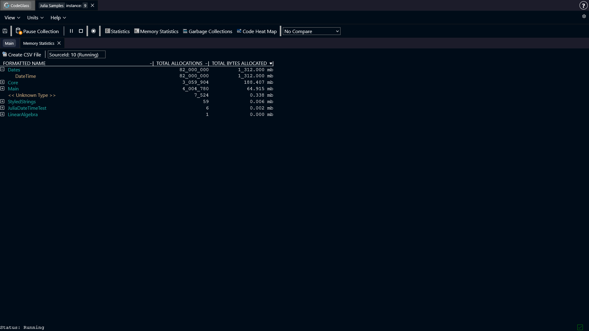
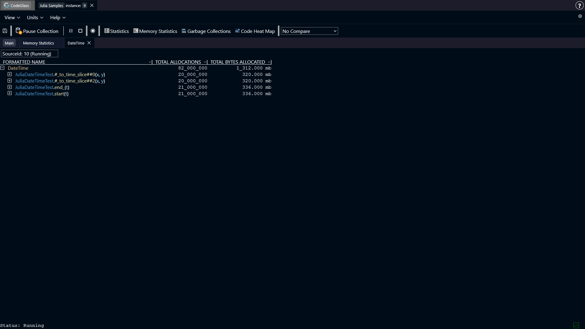
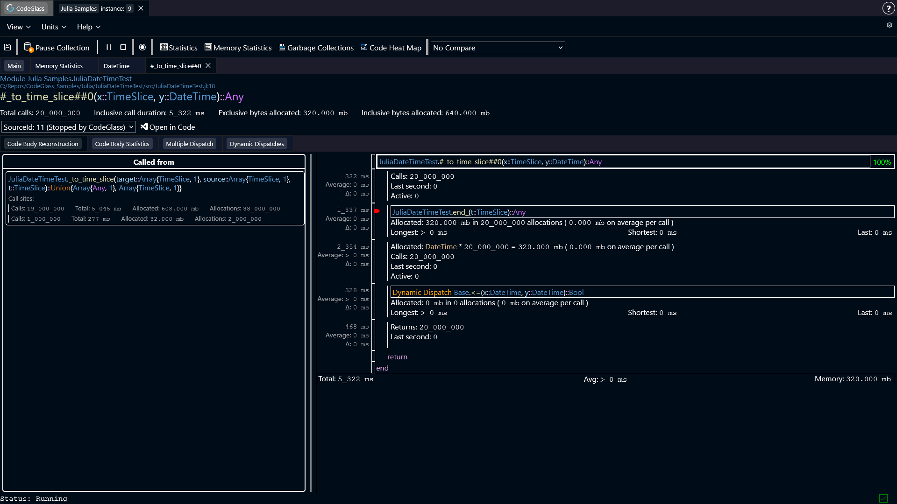
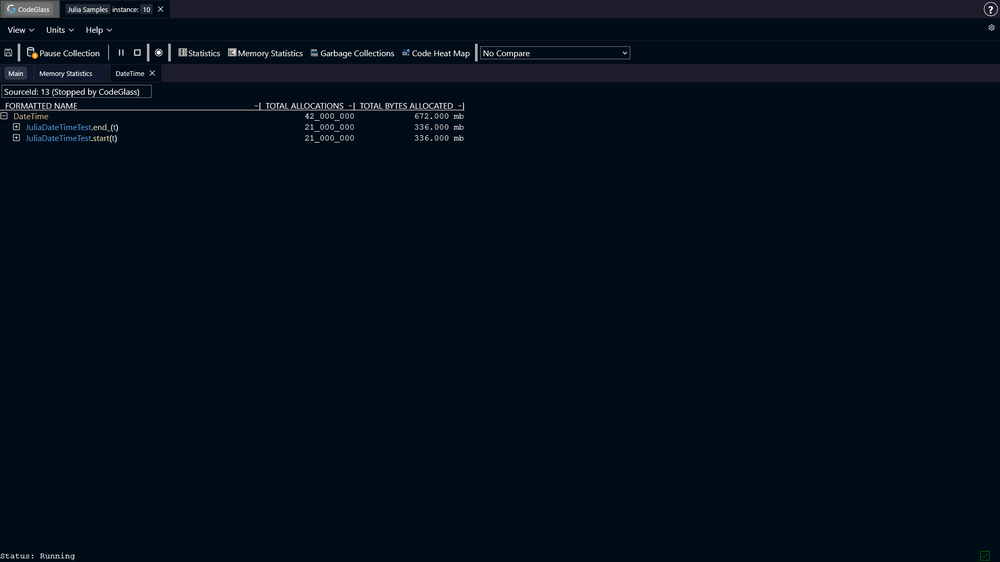

# Typed Functions, Predictable Performance

In Julia, you usually do not need to specify return types. The runtime often makes things work.
But this does not always mean that it works efficiently. And these performance costs are often hidden in plain sight. 
By looking at the code, you can logically argue that something should just work, but the compiler might not be able to figure it out.

The case described below, we came across when analyzing a customer project.
This _How To_ describes: 
- What the problem is 
- How you can find these kind of issues using CodeGlass. 
- How to solve them.
- What the benefits are of solving them.

## The Problem
:::note
The code below is an isolated snippet from the larger project. The function `get_time_slice` is a function we made to trigger the issue. 
:::

The problem that we found here was in the `start` and `end_` functions. Both these functions have the same problem and can be solved the same way. For the rest of this page, we will only look at the `end_` function.

These functions read the value from a `Ref`. Reading this value causes Julia to create a copy of the original value, which causes an allocation. This is expected behavior, and not the larger issue we want to look at in this post.

The issue here is that Julia cannot determine a return type for the `end_` function, and therefore gives the function the return type `Any`. 
Because of the `Any` type, Julia cannot make any assumption on the call sites of this function. This causes dynamic dispatches, but also allocations. 

### The Code
```julia
using Dates

struct TimeSlice
  start::Ref{DateTime}
  end_::Ref{DateTime}
end

start(t::TimeSlice) = t.start[]
end_(t::TimeSlice) = t.end_[]

function _to_time_slice(target::Array{TimeSlice,1}, source::Array{TimeSlice,1}, t::TimeSlice)
    isempty(source) && return []
    a = searchsortedfirst(source, start(t); lt=(x, y) -> end_(x) <= y)
    b = searchsortedfirst(source, end_(t); lt=(x, y) -> start(x) < y) - 1
    target[a:b]
end

function random_time_slices()
    base = DateTime(2026, 4, 4)
    slices = TimeSlice[]

    for _ in 1:10_000
        s = base + Minute(rand(0:100_000))
        e = s + Minute(rand(1:500))
        push!(slices, TimeSlice(Ref(s), Ref(e)))
    end

    return slices
end

function get_time_slice()
    t1 = TimeSlice(Ref(now()), Ref(now()))
    random_time_slices1 = random_time_slices()
    random_time_slices2 = random_time_slices()

    for _ in 1:1_000_000
        _to_time_slice(random_time_slices1, random_time_slices2, t1)
    end
end
```

## How To Find The Issue
Finding these types of issues using CodeGlass can be done in multiple ways. We found this one using the [memory statistics view](../../views/app-instance/memory-statistics).
We were looking for modules and objects where the amount of allocated memory was unexpectedly high. To find this, we sort the table on **Total Bytes Allocated**. 
Often modules like `Main` or `Core` show up at the top here, but when looking for "quick gains" in your application, you can ignore these modules. 
The issues you find here often require a deep analysis of your application to solve.

When we sorted here, we can see that the module `Dates` had a lot of allocations. In this sample that makes sense, as it is the only thing we executed, but in the full scale of the application where we found the issue, this felt off.



We can see that the struct `DateTime` has all of our allocations, so we can take a look at where this object was allocated, by double clicking the item and going to the [memory object allocator view](../../views/app-instance/mem-object-allocator-statistics) screen.



Here we can see that 4 functions were responsible for all these allocations.

The first thing that triggered us here were the lambda functions. Lambda functions often have unexpected behavior, and issues like type instability can easily be created here. We can recognize lambda functions by the '#' characters around the function name.

We can open the `#_to_time_slice##0` function in the [code member view](../../views/app-instance/codemember), to see exactly what was executed in this function.



We can see that the `end_` function allocated 320 mb over 20_000_000 allocations. These allocations are the reading of the `Ref` value as described [earlier](#the-problem).
Furthermore, the `DateTime` object is allocated in this function again, for the same amount as in the `end_` function. Also the `<=` function was dynamically dispatched.

Both of these things are caused by the `Any` type that the Julia compiler set as the return type for the `end_` function. 
The allocation happens, because Julia does not know what type of object it will get, and therefore [boxes](https://docs.julialang.org/en/v1/devdocs/object/) the value just to be sure.
The dynamic dispatch happens, because Julia does not know which version of `<=` to use, as it does not know what object it will get.

You can easily spot that `Any` is a potential issue by looking for [type severity warnings](../../concepts-and-features/julia-type-severity). The purple color for the return type of `end_` indicates that Julia most likely cannot optimize for this type.
This type of issue might also happen for other types than `Any`.

## The Solution
Solving this issue is very simple. When we look at the code, we can see that we are reading the `DateTime` object from the `Ref`. We can also see in CodeGlass that when the object is read, that it only allocated `DateTime` objects.
This allows us to confirm that it never has a different type that we have to keep in mind.

The actual fix to make in your code, is to specify `DateTime` as a return type for the `start` and `end_` function.

```julia
start(t::TimeSlice)::DateTime = t.start[]
end_(t::TimeSlice)::DateTime = t.end_[]
```

If we now run the code with the fix applied, and open the memory object allocator view again for the `DateTime` object, we can now see that the lambda functions do not show up anymore.



## The Benefits
As can be seen in the screenshot above, the lambda functions are now gone. Specifying the return type allowed Julia to do the following things:
- Julia did not have to create extra allocations.
- Julia did not have to dynamically dispatch a call to `<=`.
- Because of the changes above, Julia could now fully inline the expression.
- Because of the fewer allocations that happen, the garbage collector has less pressure, causing less time to be spend there.
- Cascading type instability has been removed. Having the dynamic dispatch, caused other functions in the flow to also become a dynamic dispatch. Solving this one, also resolved many of the others.