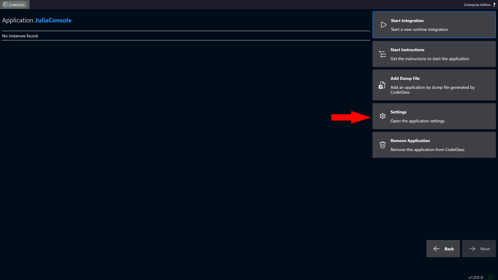
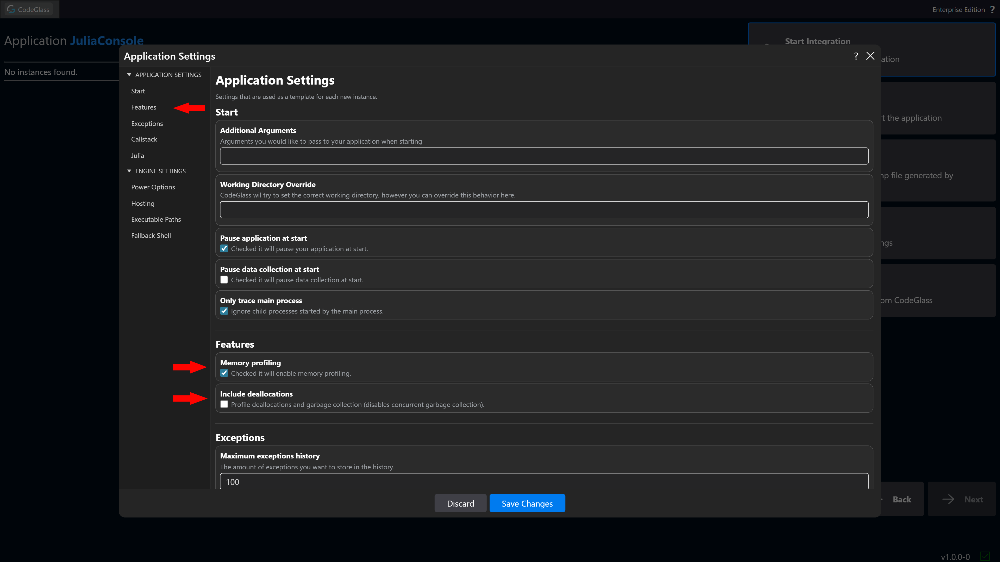
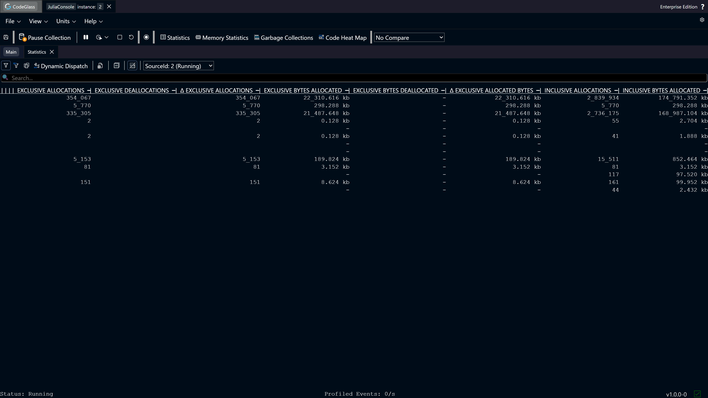
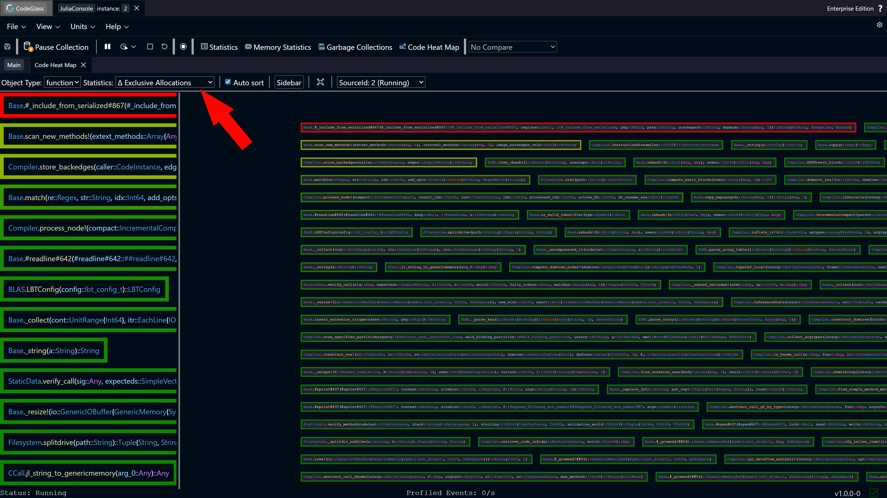
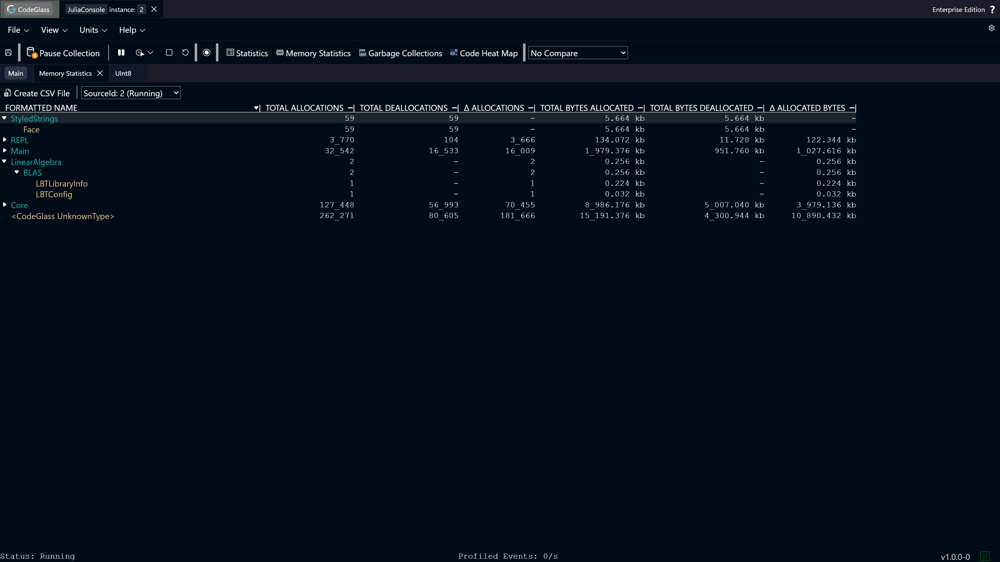
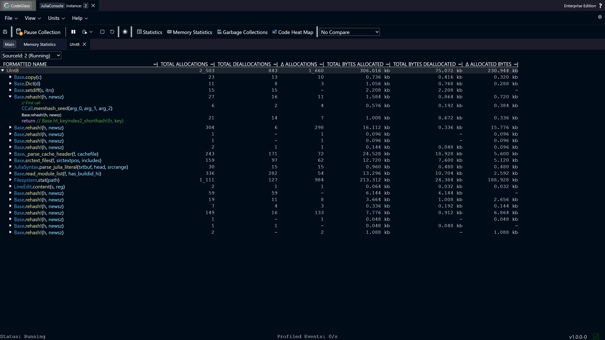

# Memory Profiling

In this *How To*, we explain how to inspect the memory usage of your application. First, we cover how to enable memory profiling. Then, we describe the different views related to memory profiling.

This post will go into:
- The necessary settings
- What views can be used

:::info
This *How To* assumes that you already have CodeGlass fully [setup](../../category/getting-started), and that you have already [created an application](../../views/general/application-list#add-application).
:::

## How To Turn On Memory Profiling

To enable memory profiling, go to the application you want to profile and click the **Settings** button on the right side of the screen.

This opens the [settings screen](../../views/general/settings) for that application. From here, you can scroll down to [Features](../../views/general/settings#features) or click the **Features** button on the left side of the screen.

To enable memory profiling, you will have to turn on the [Memory Profiling](../../views/general/settings#memory-profiling) setting.  
If you also want to track memory deallocations and garbage collections, enable the [Include Deallocations](../../views/general/settings#include-deallocations) setting.

The next time you start a new instance, memory profiling will be enabled, and the data will be available in the views described below.

## Memory Views

There are multiple [views](../../views/app-instance/application-instance#view) where you can inspect the collected memory profiling data. In this section, we explain four different ways to analyze this data. On every view you have the option to sort on a statistic.

If you are experiencing issues with excessive memory allocation, we recommend sorting by *Exclusive Allocations* and/or *Exclusive Bytes Allocated* to identify which functions allocate the most memory.

If you are experiencing issues with memory not being freed, we recommend sorting by *Δ Allocations* and/or *Δ Allocated Bytes* to identify functions that allocate memory but do not properly deallocate it.

:::info
In table views, the columns **Δ Allocations** and **Δ Allocated Bytes** are only available if [**deallocation profiling**](../../views/general/settings#include-deallocations) is enabled.
:::

### Statistics

The first way to identify memory issues is through the [statistics view](../../views/app-instance/statistics). This table contains multiple [columns](../../views/app-instance/statistics#types-of-statistics) with memory profiling data grouped by function and/or module.

### Heat Map

In the [heat map view](../../views/app-instance/heat-map), you can sort by any memory statistic to see which functions stand out compared to others.

### Memory Statistics

Next up is the [memory statistics view](../../views/app-instance/memory-statistics). It is similar to the [statistics view](#statistics), but this table groups the memory profiling data by memory object and/or module of that memory object. 

### Memory Object Statistics

Each memory object shown in a view can be double-clicked to navigate to the [memory object statistics view](../../views/app-instance/mem-object-allocator-statistics). This view provides a clear overview of which functions allocated that memory object and even the [code paths](../../concepts-and-features/code-path) within each function.

