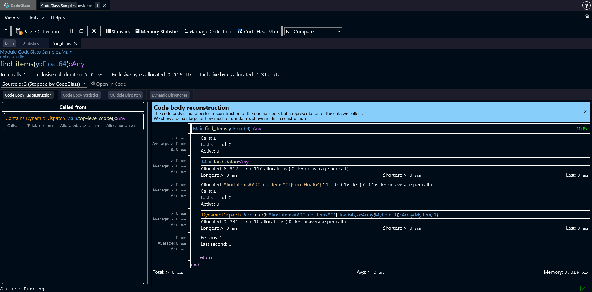
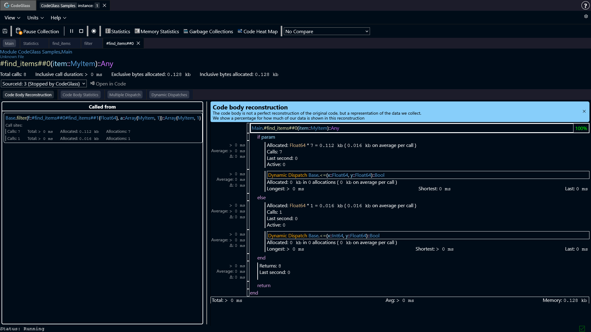
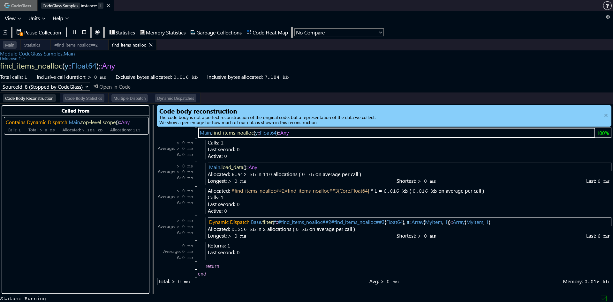
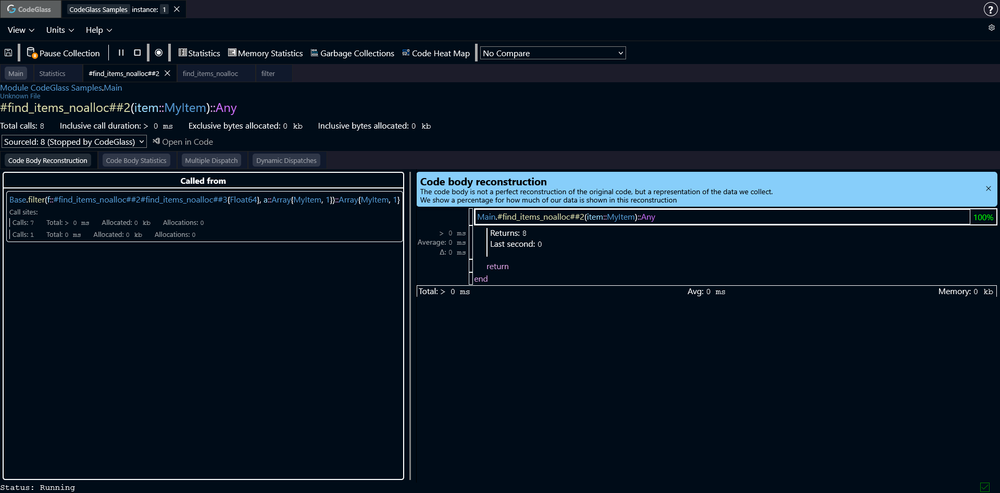

# Solve Implicit Conversions

One of the features of Julia is that you do not have to provide types for every value. This makes it easy to write code quickly. The compiler figures out the types based on how values are used.
Most of the time this works well, and you do not have to think about it.
However, this behavior can sometimes affect performance. The compiler may add extra work behind the scenes to make your code run correctly. This is not visible in your source code, and it is also not always obvious when running the program.
This guide shows what happens in these cases and how it can lead to extra allocations and slower code.

## The Code

Below is a small code snippet that we will use for explaining the issue.

:::info
The code sample has the goal of showing the behavior of the issue. It does not represent real world code, and might not keep all the standards and best practices.
:::

```julia
using CodeGlass
using JSON

struct MyItem
    value1::Real
    value2::String
    value3::Bool
end

function find_items(y)
    items = load_data()
    return filter(item -> item.value1 <= y, items)
end

function load_data()
    raw = JSON.parse("""
        [
            {"value1":1.1,"value2":"Hello","value3":true},
            {"value1":5.6,"value2":"world","value3":true},
            {"value1":12.3,"value2":",","value3":true},
            {"value1":16.5,"value2":"how","value3":false},
            {"value1":20.4,"value2":"are","value3":false},
            {"value1":69.9,"value2":"you","value3":false},
            {"value1":80.1,"value2":"today","value3":true},
            {"value1":99,"value2":"?","value3":false}
        ]
    """)
    return [MyItem(item["value1"], item["value2"], item["value3"]) for item in raw]
end

items = @cgprofile find_items(100.0)
```

This example loads JSON data, converts it into a struct, and filters the items.

Before the `find_items` call, we add the `cgprofile` macro defined in the [CodeGlass.jl](../languages/julia#codeglassjl) package. This will automatically create a [recording](../concepts-and-features/datasources#recordings) of the call, allowing us to focus on just the code that we are interested in.

## The Implicit Conversion

Looking at the `find_items` function in CodeGlass, the [code body reconstruction](../views/app-instance/codemember#code-body-reconstruction) shows a call to `filter`. Just like we expected.
However, the `filter` call allocates more memory than expected. You would expect, `filter` to just loop over the array and apply the condition.



Looking deeper, we find the lambda function passed to `filter`. These functions often have generated names, such as `#find_items##0`.



Inside this function, the compiler created multiple [code paths](../concepts-and-features/code-path) for the `<=` call. It also had to use dynamic dispatch, because it could not determine the exact types.
Before calling the comparison, a `Float64` is allocated. This happens because the compiler inserts implicit conversions to make the types match.
In this example, the allocation happens once per item. With only 8 items this is small, but with larger datasets this quickly adds up.

## Fixing the Issue

One way to avoid these allocations is to make the types more explicit.

```julia
function find_items_noalloc(y)
    items = load_data()
    return filter(item -> 
        (
            ( item.value1 isa Float64 && (item.value1::Float64) <= y) 
            || (item.value1 isa Int && (item.value1::Int) <= y)
            || item.value1 <= y 
        ), items)
end

items = @cgprofile find_items_noalloc(100.0)
```

Running this version shows fewer allocations in the `filter` call.



Looking at the lambda function again shows that no extra calls or allocations are needed.



Because the types are now clear, Julia can fully optimize the code and inline the operations.

## How To Find These Issues
Now that we know how these issues happen and what they look like, you probably have the question: How can I find these issues.

Unfortunately there is no simple answer to this question. But CodeGlass can help you. 

One of the places that we have often found implicit conversion is around operator functions. 
Operator functions are functions like: `+`, `-`, `<=`, etc. You can use the **search bar** on the [statistics screen](../views/app-instance/statistics#search) to search for these functions.
Julia might make many specialized versions of these functions, so make sure that you also check the [multiple dispatch](../views/app-instance/codemember#multiple-dispatch) view.

Another way to find these conversions is by checking where primitive types get allocated a lot. Primitive types, like: `Int64`, `Float64`, `Bool`, etc, usually shouldn't allocate any memory. 
Only when the value has to get boxed, does it get allocated. A primitive type that is allocated, is (most of the time) something that is not supposed to happen and worth investigating. 
You can use the [memory statistics](../views/app-instance/memory-statistics) view, to see all allocated objects. By double clicking on any of these objects, you can also see in which function they got allocated on the [memory allocator](../views/app-instance/mem-object-allocator-statistics) view.

A last way to find implicit conversions is when it gets passed as a value to a function that expects an abstract type.