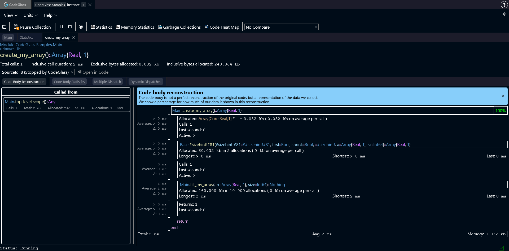
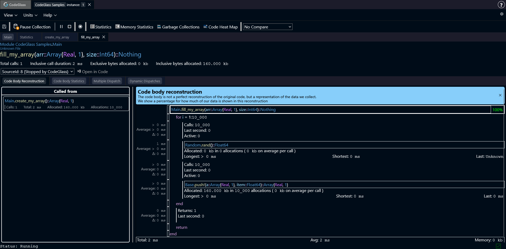
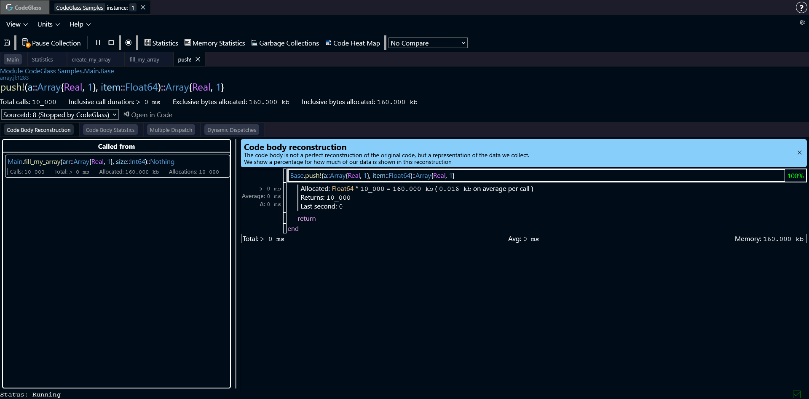
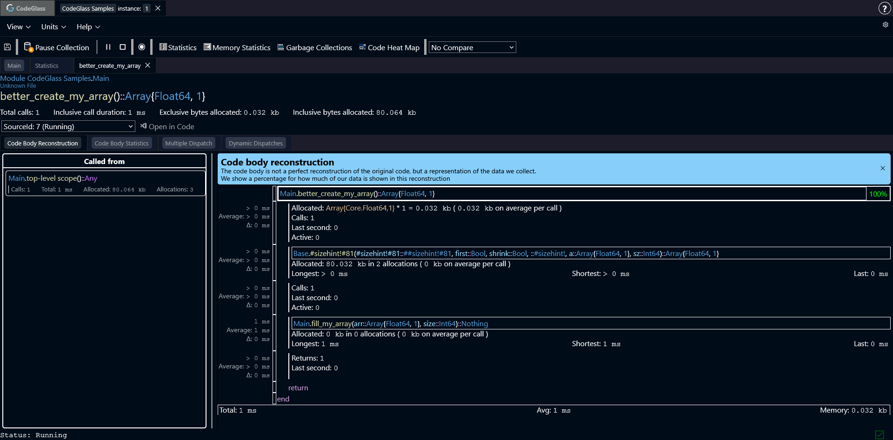
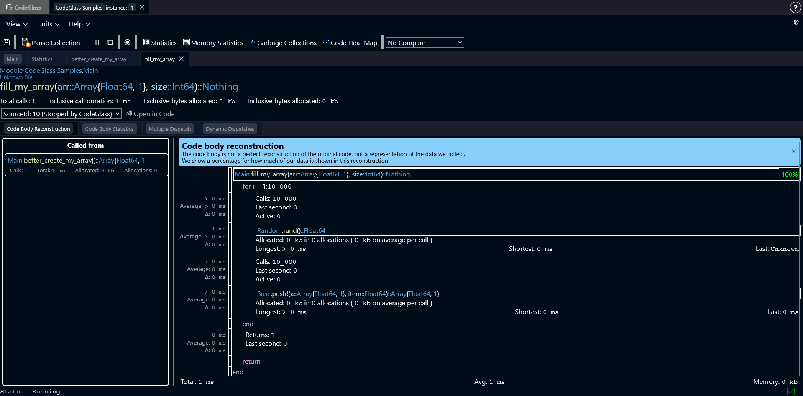

# Inefficient Array Types
In Julia it can be very easy to accidentally use the wrong type when creating an array. Either because you used a type that was to broad, or because you just let the compiler figure out what type is best to use. And most of the time Julia does choose the best type possible. 
But in some cases the compiler is unable to determine the most optimal type, and it quietly chooses for something that just works. In those cases, the compiler might create something like the code below.

:::info
The code sample has the goal of showing the behavior of the issue. It does not represent real world code, and might not keep all the standards and best practices.
:::

```julia
using CodeGlass

function create_my_array()
    a = Real[]
    sizehint!(a, 10_000)
    fill_my_array(a, 10_000)
    return a
end

function fill_my_array(arr::Array, size)
    for _ in 1:size
        num = rand()
        @noinline push!(arr, num)
    end
end

my_array = @cgprofile create_my_array()
```

In the sample, you create an array of `Real`, reserve 10.000 items, and than fill it with 10.000 random values. 
This code does not seem like it contains any real issues. The `rand` function returns a `Float`, and floats are considered a `Real` value so it should all be fine.



If we look at what CodeGlass reports, we first see that we allocate the pointer of the array. After that we can see that `sizehint!` gets called. 
This function has allocated quite a bit of memory, but that is expected. It has to create the array "body" where each item can be stored. As we are creating an array of 10.000 items, it has to reserve enough memory to store all those 10.000 items.

After that we can see the function `fill_my_array`, and it allocated twice the amount of memory that we reserved for the array. That does not feel right.
Opening that function, shows us the following information.



CodeGlass shows exactly what our code did. We looped 10.000 times, created a random value and added it to the array. But the `push!` function allocated something every time that it was called.
Opening that function shows that it allocated a `Float64` every time that it was called.



Now why does `push!` have to allocate the float every time it tries to add an item to the array?

The answer to this question is fairly simple. In our sample we made an array of type `Real`, assuming that it was just a way to make it work for multiple types of numbers.
But this type is actually what is causing our issue. This is because the type `Real` is an abstract type. In CodeGlass you can see this because the type is purple.
The problem with an abstract type is that the compiler now does not know what value is going to get added as every object that extends `Real` is valid. 

So instead of being able to just place the raw float value in the array, Julia needs to assume that any `Real` value can be added. The problem is that not all `Real` values have the same size as a `Float64`.
To make sure that everything can be added, Julia forces every item to be heap allocated, and only put the pointer to that object in the array. So now for every item you add, you also have to box that item and put it on the heap.

:::info
CodeGlass reports that a Float64 is 16 bytes, but if you run `sizeof(Float64)` in Julia it returns 8 bytes. This is because CodeGlass reports the actual size that an object takes up in memory. This includes the objects box, but also the "allocation slack" of it having to be placed in a pool.
:::

## The Solution

Solving this issue is very simple: replace `Real` with `Float64`. Now Julia knows that every value will be of type `Float64` and knows the size of the object. 
This allows it to put the raw value into the array, preventing it from having to get boxed. If we run the new code, and look at what CodeGlass reports, we can see that the allocations are now gone.

```julia
function better_create_my_array()
    a = Float64[]
    sizehint!(a, 10_000)
    fill_my_array(a, 10_000)
    return a
end

my_array = @cgprofile better_create_my_array()
```





## How To Find These Issues

One of the ways to start tracking down these types of issues, is by going to the [code member](../views/app-instance/codemember) view of functions like `push!`, and then switching to the [multiple dispatch](../views/app-instance/codemember#multiple-dispatch) view. Here you can see every specialization that Julia made for this function. On this view, you can sort the statistics table based on the memory it created. Functions that have allocated a lot, might have done so because of the too broad type that was used. It can also help to check the [type severity](../concepts-and-features/julia-type-severity) of functions. Functions that use an abstract type are more likely to have to create extra allocations.

Another way of finding these issues is through the [memory statistics](../views/app-instance/memory-statistics) view. Here you can look for any object that uses a generic type as type specifier, as those have the highest change of having to create additional allocations.