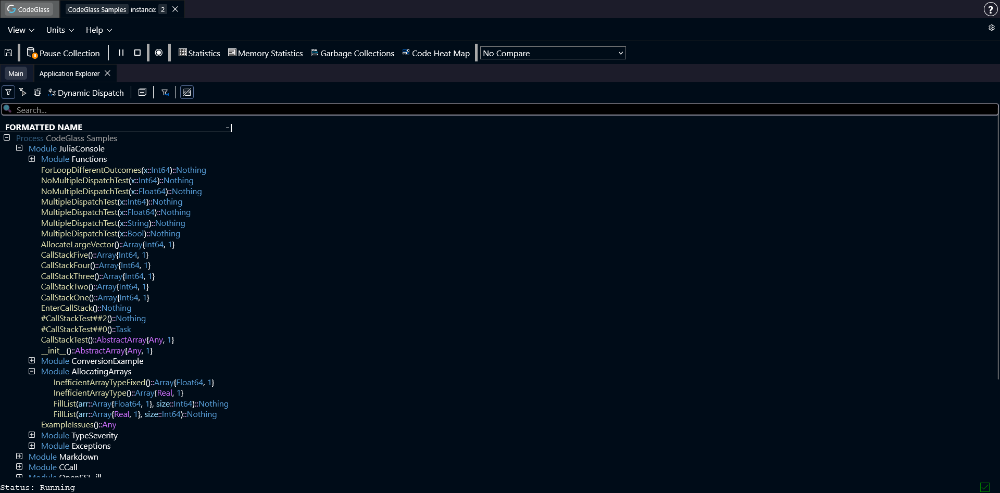

# Application Explorer

This **Application Explorer** shows all functions that were loaded during this profiling session, in the form of a tree. All the functions are grouped by the module they are defined in.

Here you can also see that some if the types have different colors. These colors are related to type severity. More information about type severity can be found [here](../../concepts-and-features/julia-type-severity).

Clicking on any of the functions, will open the [Code Member](./codemember) screen.

## Toolbar and Filtering
Just above the list of all modules and functions, you can find a toolbar. This toolbar is primarily used to switch between different filtering modes.
More information about filtering can be found [here](../../concepts-and-features/filters).

Below the filtering option, you find the search bar. Here you can search for a specific function by its name. Double-clicking on any of the search results will expand the tree until it finds the searched function.