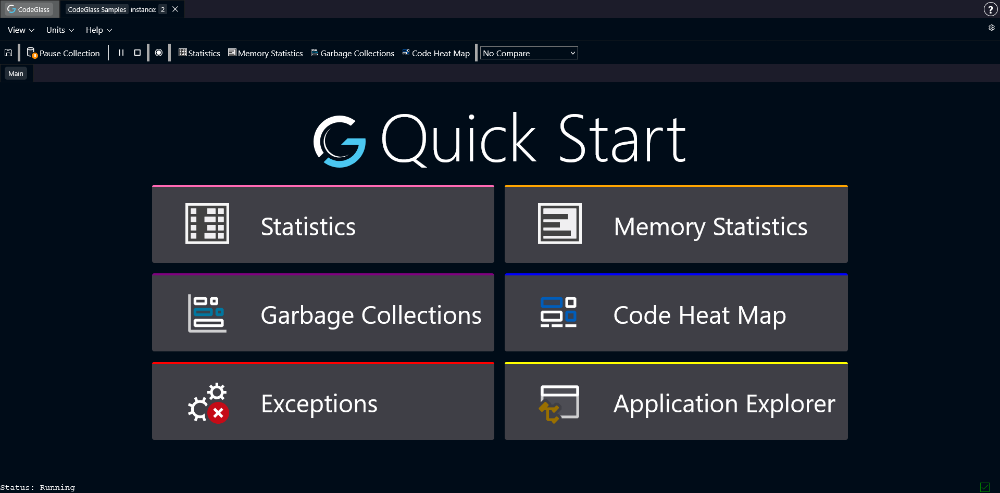
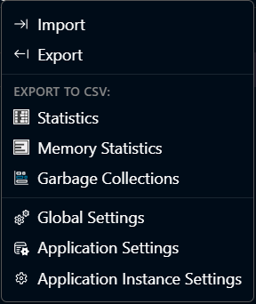
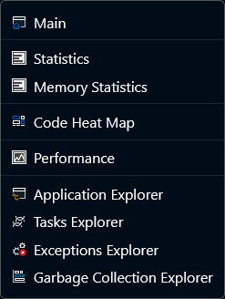
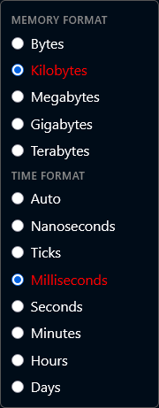
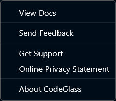
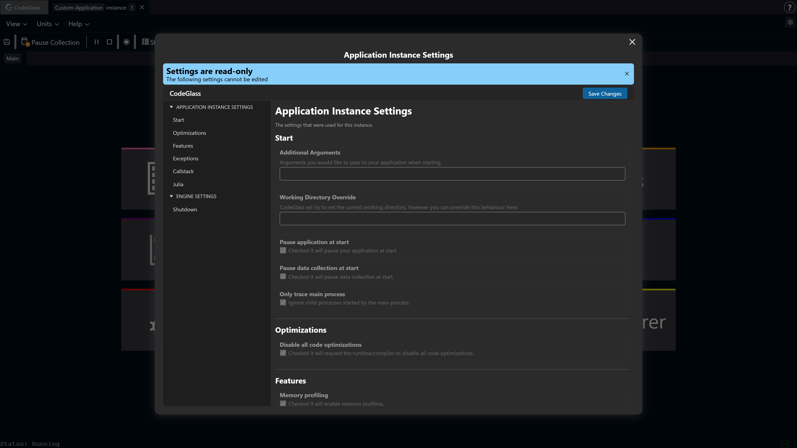
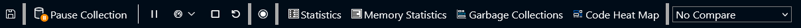
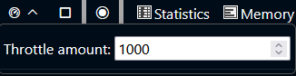
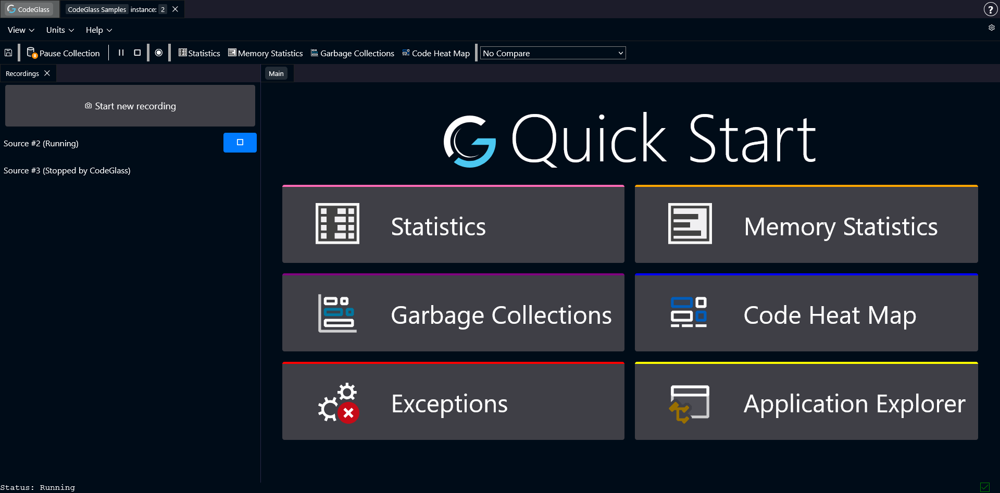

# Application Instance

When you open an **application instance**, this is the first page you see.

From here you can navigate to all other views and tools available for this instance.

These are all the current available tools and views in CodeGlass:
- [Function Statistics](./statistics)
- [Memory Statistics](./memory-statistics)
- [Heat Map](./heat-map)
- [Performance view](./performance)
- [Application Explorer](./application-explorer)
- [Task Explorer](./task-explorer)
- [Exception Explorer](./exceptions)
- [Garbage Collection Explorer](./garbage-collections)

## Open Instances

At the top of the page there is a **tab bar**.  
Each instance you open appears here as a separate tab.

You can switch between instances by clicking the corresponding tab.

## Instance Menu Bar

Below the instance tabs is the **instance menu bar**.  
This menu allows you to open different views and adjust some interface settings.  
You can also view the settings which the instance used at startup.

### File

The **File** menu contains options for importing [Dump Files](../../concepts-and-features/dumpfiles) and exporting Dump Files and CSV files.   
You can also check the three different levels of [settings](../general/settings).

### View

The **View** menu contains links to all available screens for the current instance.

### Units

Different applications may require different levels of detail when viewing statistics.  
In this menu you can choose which **units** CodeGlass uses when displaying performance data.

### Help

The **Help** menu provides links to documentation and support pages.

### Settings (Gear Icon)

This view shows what [**Settings**](../general/settings) were used on the startup of this instance. These settings cannot be changed.

## Toolbar

The **toolbar** is the main control panel for the current instance.  
From here you can control the [Agent](../../intro#agent) and quickly access commonly used features.

The items below explain each item in the toolbar from left to right.

### Create Dump File
:::info
This functionality can also be called from the running application, such as in Julia using [CodeGlass.create_dump_file()](../../languages/julia#creating-dump-files). 
:::
This button creates a [**dump file**](../../concepts-and-features/dumpfiles) containing all collected profiling data up to that moment. The file is automatically downloaded to your computer.

Dump files can later be uploaded again using the buttons on the [Application List](../general/application-list#add-dump-files) screen, the [Instance List](../general/instance-list#add-dump-files) screen, or by dragging and dropping the file onto any page.

Each dump file is **fully self-contained**, so it can also be shared with other users who can open it on their own system.

:::warning
Keep in mind that our dump files are very **detailed** and include a lot about your application, you might not want to share it with just any one.
:::

### Pause / Continue Data Collection
This button pauses or resumes data collection by the agent. While paused, the agent stops sending data to the [Engine](../../intro#engine).

More information about this feature can be found [here](../../concepts-and-features/pause-data-collection).

:::info
Pausing data collection can improve the performance of the application being inspected by CodeGlass.
:::

:::warning
When data collection is resumed, the agent immediately starts sending data again. CodeGlass may interpret this as if the next function call happened directly after the last one before the pause. This can reduce the accuracy of some statistics.

More information about what to look out for can be found [here](../../concepts-and-features/pause-data-collection).
:::

### Pause / Continue Application

This option pauses the application itself, freezing it in its current state. Pressing the button again resumes execution.

Unlike pausing data collection, pausing the application **does not affect profiling accuracy**, time spend in this state is also removed from statistics to keep the profiling accuracy.

### Throttle Menu

This option allows you to throttle your application. Clicking the icon enables or disables the throttling. 
When you throttle an application, you limit the amount of function that CodeGlass collects per second.

You can set the throttle amount by expanding the menu.

### Stop Application

This button immediately terminates the application.

:::note
This is a forced stop. The application does not get the chance to perform normal shutdown or cleanup tasks.
:::

### Restart

This button stops the current instance in the same way [Stop Application](#stop-application) would, but it also starts a new instance based on the current application agent settings.

:::info
Restart only works for applications made using the **Julia REPL** or **Julia Project** template.
:::

### Recording

This button opens the **recording sidebar**.

From this panel you can start, stop, and manage [recordings](../../concepts-and-features/datasources#recordings). Recordings allow you to capture specific parts of a profiling session and analyze them separately.

You can also compare recordings with each other to see how behavior changes between runs.

### Data Source Comparison

After creating recordings, you can select one from the dropdown menu here to use as a **comparison source**.

The running instance is considered the **main data source**, while each recording acts as an additional data source that can be compared against it. 
Comparing data sources results in the statistics of the **comparison source** being subtracted from the **selected source**. This means statistics can show as negative.