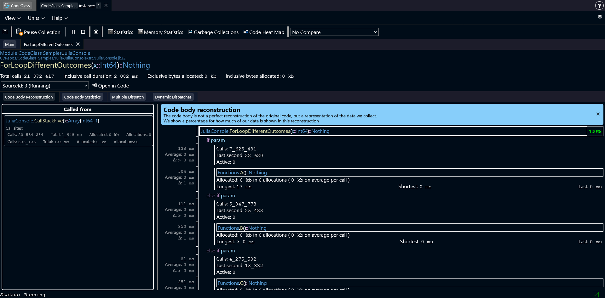
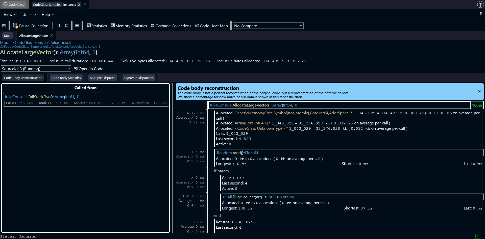
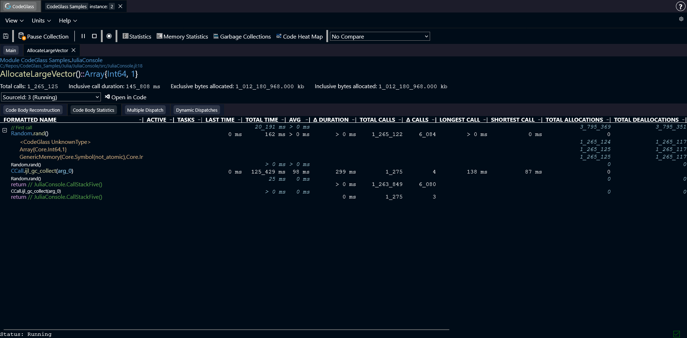
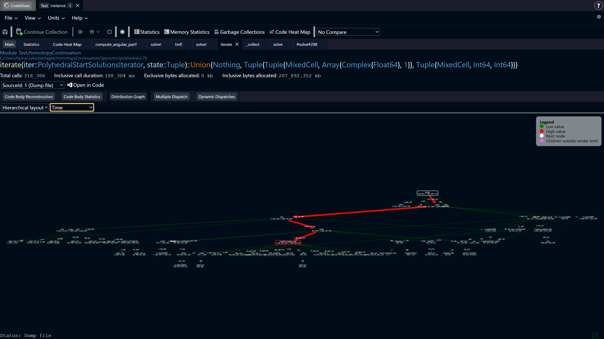
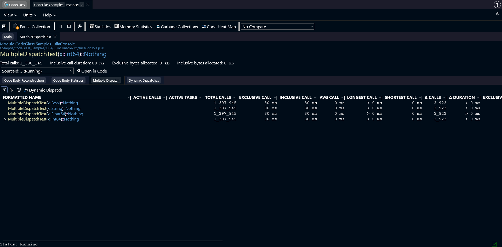
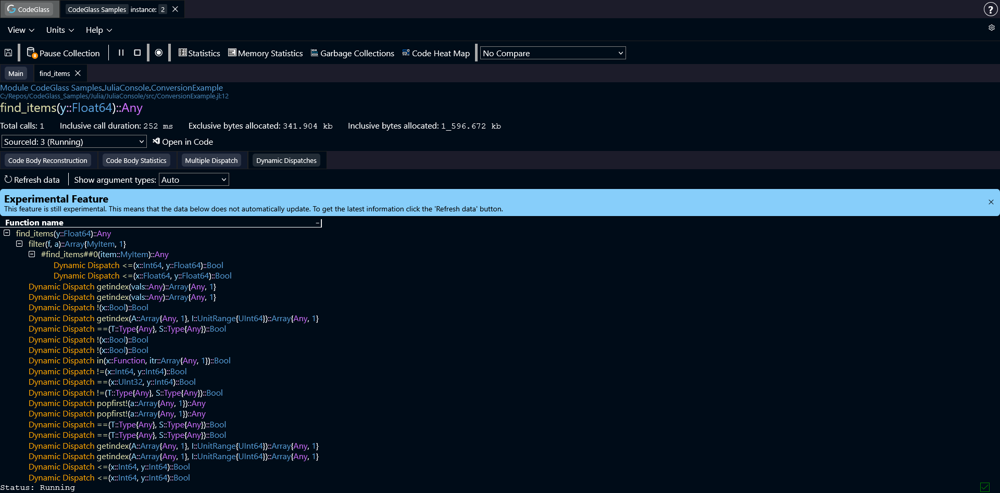

# Code Member

The **Code Member** screen shows detailed information about what happened inside the body of a specific function.

To give a clear overview, this view contains several tabs. Each tab focuses on a different type of information about the function.

At the top of the page you can see some basic details about the function. This includes the module where the function was defined, the source file, and the line number of the function definition.

Below that you will see the **function signature**. This includes the function name, all arguments with their types, and the return type. The types shown here are the exact types that Julia used when compiling this specific function specialization.

Some of these types have different colors like orange or purple. What these colors mean is explained in more detail [here](../../concepts-and-features/julia-type-severity).

Under the function name you will find several general statistics, such as:

- The total number of times the function was called  
- The inclusive execution duration  
- The amount of memory allocated by the function

Below the statistics you can select the [data source](../../concepts-and-features/datasources) you want to inspect. There is also a button that opens the function directly in **Visual Studio Code**.

:::info
The **Open in Visual Studio Code** button always attempts to open the file, even if the file does not exist on your system.
:::

## Code Body Reconstruction

:::info
The Code Body Reconstruction does not reflect your original source code, but it (tries to) reflects what the compiler and runtime made of your source code and what was executed. Because of this, reconstructions can sometimes be incomplete, inaccurate, or missing information, visible by the percentage counter. 

At the top of each reconstruction, there is a counter to show how complete the reconstruction is. The counter shows the number of included [code paths](../../concepts-and-features/code-path) in the reconstruction and the total number of available code paths for this codemember.
:::

The first tab is **Code Body Reconstruction**. This view attempts to recreate the structure of the function body based on the runtime events that were captured during execution.

For each function call in the reconstruction, CodeGlass shows statistics related to that specific call path.

These statistics apply only to that **specific location in the code**. If the same function is called from multiple places, the statistics shown here only reflect the calls made from this particular location.
:::note
In some cases the reconstruction algorithm can decide to "merge" two code paths that call the same function. This also causes the statistics to merge. This is done to make the reconstruction look more like the source code. If you want to see every code path 100% separated, you can use the [Code Body Statistics](#code-body-statistics) tab.
:::

Clicking on any function call opens the **Code Member** view for that function.

### Allocations
If a [code path](../../concepts-and-features/code-path) allocated memory, it is also included in the code body reconstruction. 

Next to the name of the object that was allocated, it also shows how many times this object was allocated, and how much memory this allocated in total. It also shows an average of how much memory it allocated per call of function which you are inspecting right now.

Clicking on an object, switches to the [Code Body Statistics](#code-body-statistics) tab, and puts focus on the allocated object in the code path.
:::info
CodeGlass always know that an allocation happens and how much it allocates, but might not always know what type is being allocated, in these cases it shows: "Unknown Type". This will occure less and less with every update of CodeGlass.
:::

### Called From

This is the sidebar on the left side of the Code Body Reconstruction.

It shows all functions that called the function you are currently inspecting. Statistics for those calls are also shown.

Each **call site** represents a unique [**code path**](../../concepts-and-features/code-path) through which the current function was executed.

## Code Body Statistics

  

This tab lists all executed **code paths** that are part of this function, together with their statistics.

The name shown **above** each function name indicates the function that was executed immediately before this one.

If a code path allocated memory, you can expand the row to see more detailed statistics about those allocations.

You can click on any column header to sort the table by that statistic.

## Distribution Graph
  
  

This tab renders a dynamic call graph that visualizes how selected statistics are distributed across function calls.
For simplicity, the examples below assume the selected statistic is **allocation count**.

Each function call is represented as a node.
The node’s border color and size reflect its **exclusive allocations**. There is also additional information encoded in colors as reflected in the legend:
* Red = high allocation count
* Green = low allocation count
* Purple = child nodes are not rendered completely, as the limit of 150 nodes was hit
* White = this is the root node, the current code member

Edges use the same visual encoding, but represent the **inclusive allocations** of the target node.

The relevant statistic for a node is shown in the following format:
``Exclusive allocations / Inclusive allocations``

If a node’s exclusive allocations are lower than its inclusive allocations, it means additional allocations occur in its child calls.
Edges to those child nodes indicate how many allocations are attributed to them.

:::note
CodeGlass collects aggregate statistics.
As a result, a child node can show more inclusive allocations than its parent.
This happens when the child function is also called from other parts of the program that are not included in the current graph.
:::

## Controls

You can move around the distribution graph by clicking and dragging with the mouse. Clicking on any of the nodes opens the [Code Member](./codemember) screen of this function.

Use **Ctrl + Scroll** to zoom in and out.

### Toolbar

The toolbar lets you choose both the **render type** and the **statistic** displayed.

We support two **render types**:

* **Spiderweb**: Nodes are arranged radially around a central point
* **Hierarchical**: Nodes are displayed in a top-to-bottom tree structure

You can switch between three statistic types:

* Time
* Allocated bytes
* Allocation count

Depending on the size of the graph, updating the statistic type may take up to half a minute.

## Multiple Dispatch

  
Julia often improves performance by creating **specialized versions** of functions for different argument types.

The **Multiple Dispatch** tab shows all specializations of this function that were created with different argument types.

Clicking on any function call opens the **Code Member** view for that function.

The [types of statistics](./statistics#types-of-statistics) are the same types shown in the statistics view.

As with other tables, you can sort the results by clicking on any column.

### Toolbar
The toolbar allows you to apply filters. More information about filters can be found [here](../../concepts-and-features/filters).

## Dynamic Dispatch

When Julia cannot determine the types for a function call at compile time, it performs a **dynamic dispatch**.

This tab displays the full call tree related to this function and highlights where dynamic dispatch occurred.

Some of the functions can be expanded to go deeper into the call tree, to get insight into the dynamic dispatches that happened in that function. You can also double click on any of the functions to open the code member screen for that function.

:::note
If a code path does not contain a dynamic dispatch anywhere in its call tree, that code path is not included in this view.
:::

### Toolbar

The first button in the toolbar reloads the data in the call tree. The data in this view does not update automatically, so if new code paths were created during the running of the application you have to refresh the view by pressing this button. 

The second control is a dropdown that determines how **argument types** are displayed. In Julia, argument types can be very long, which can make the interface difficult to read.

To reduce clutter, you can choose how types are shown:

- **Auto** (default): show argument types for dynamically dispatched functions and the function that called them  
- **Always**: always display all argument types  
- **Never**: hide argument types completely