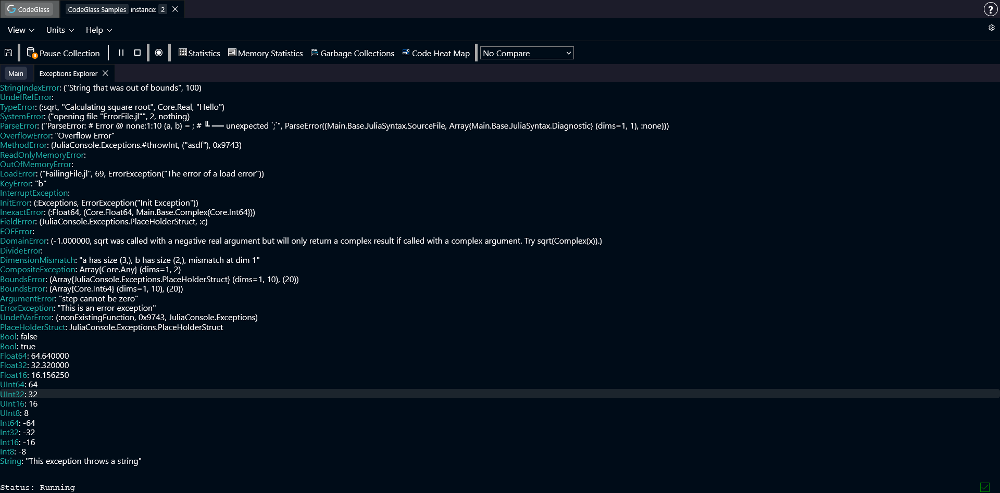
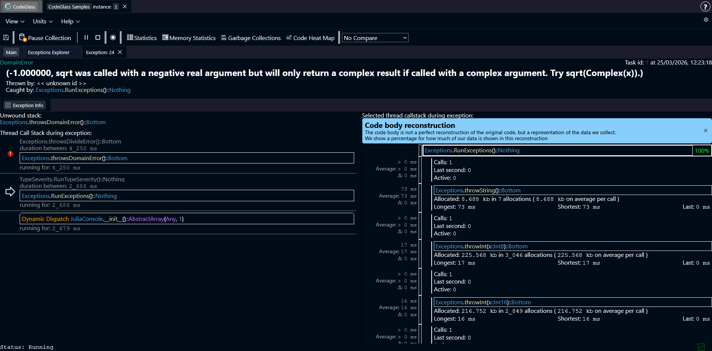

# Exceptions

:::info
If exceptions happened outside any of the inspected area, CodeGlass won't collect it as it is unable to link any events to it.
:::
CodeGlass records every exception that happens while your application is running.  
When an exception occurs, CodeGlass tries to collect the exception type and, if available, the exception message.

## Exception Explorer

The **Exception Explorer** shows a list of all exceptions that occurred in your application.

Double-clicking an item in the list opens the [Exception Details](#exception-details) view.

## Exception Details

This view shows all information CodeGlass collected about the exception.

At the top you can see a header with basic information, such as the exception type and the exception message. 
Sometimes the exception type starts with [TaskFailedException](https://docs.julialang.org/en/v1/base/base/#Base.TaskFailedException) followed by another exception type. This means that the entire task failed to execute because of the second exception.

Below that you can see which function threw the exception and which function caught it.  
Double clicking on these functions opens the [Code Member](./codemember) view for that function.

:::info
If CodeGlass did not collect the function that an exception occurred in, it shows `<<unknown id>>`. These items cannot be clicked to open.
:::

### Exception Info

Below the header you will find the **Exception Info** section. This section contains additional details about the exception.

Two important items shown here are:

- **Unwound Stack** – Shows the functions that returned because of the exception until a catch block was found.
- **Thread Call Stack** – Shows the full call stack of the thread at the moment the exception occurred.

Clicking on an item in the thread call stack updates the [Code Body Reconstruction](./codemember#code-body-reconstruction) view for that function.
Double-clicking on an item opens the [Code Member](./codemember) screen for this function.