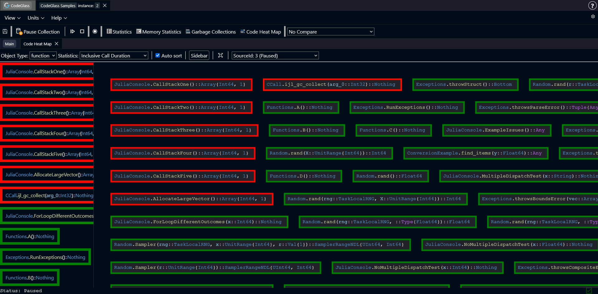

# Heat Map

The **Heat Map** view helps you quickly spot hot spots in your application.

Instead of showing a large table, this view displays functions as colored blocks. The blocks are ordered and colored based on a selected statistic.

Functions that perform worse compared to others appear **more red**. Functions that perform better appear **more green**. This makes it easier to see which parts of the code may need attention.

## Toolbar

Above the heat map there is a toolbar. These options control how the heat map displays data.

- **Object Type**: a dropdown that controls how the data is grouped. By default it groups by **function**, but you can also group by **module**.
- **Statistic**: select which statistic the heat map should use to color and order items.
- **Auto sort**: when enabled, the heat map automatically reorders items when you change the statistic, or when new functions get profiled.
- **Sidebar**: toggles the [sidebar](#sidebar) on or off.
- **Recenter**: moves the heat map back to the center. Useful if you zoomed or dragged the view too far.
- **Data source selection**: select which [data source](../../concepts-and-features/datasources) the heat map should use.

## Sidebar

The sidebar shows the same data as the heat map, but in a list. Keep in mind that it only shows the items that are currently visible in the render view port.

## Controls

You can move around the heat map by clicking and dragging with the mouse. Double clicking on any of the functions opens the [Code Member](./codemember) screen of this function.

Use **Ctrl + Scroll** to zoom in and out.
