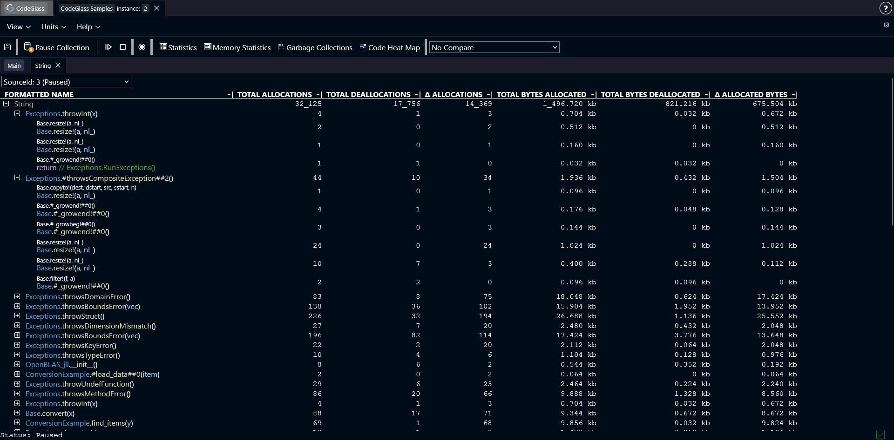

# Memory Object Allocator Statistics

:::info
This view is only available when [**memory profiling**](../general/settings#enable-memory-profiling) is enabled.
:::

The **Memory Object Allocator Statistics** view shows every function that allocated this specific object.

Besides showing which functions allocated the object, you can also expand a function to see the exact [code paths](../../concepts-and-features/code-path) where the allocation happened.

Double-clicking on a function opens its [Code Member](./codemember) view.  
Double-clicking on one of the code paths opens the Code Member view for the function that contains that code.

You can click on any column in the table to sort the data by that statistic.

## Toolbar

Above the table there is a toolbar.

Here you can choose which [data source](../../concepts-and-features/datasources) the view should display data from.

## Types of Memory Statistics

- **Total Allocations**: The total amount of times this object was allocated.
- **Total Deallocations**: The total amount of times this object was deallocated.
- **Δ Allocations**: The difference between the total amount of allocations and deallocations.
- **Total Allocated Bytes**: The total amount of bytes allocated for this object.
- **Total Deallocated Bytes**: The total amount of bytes deallocated for this object.
- **Δ Allocated Bytes**: The difference between the amount of allocated and deallocated bytes.