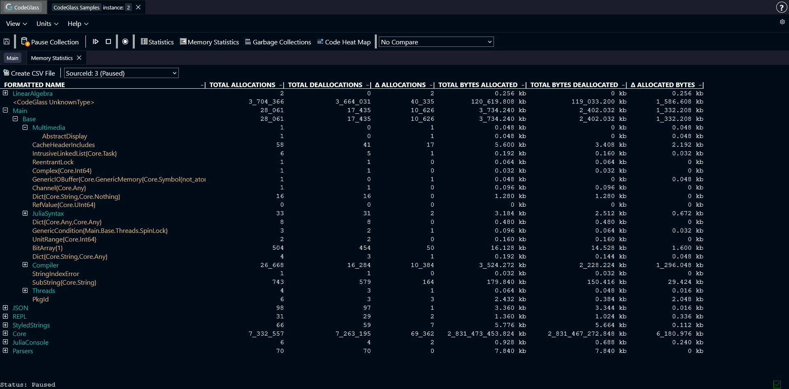

# Memory Statistics

:::info
This view is only available when [**memory profiling**](../general/settings#enable-memory-profiling) is enabled.
:::

The **Memory Statistics** view shows an overview of every object type allocated during the run of your application, together with some statistics for this object.

Objects are grouped by the module where they are defined. Double-clicking a module opens a new view that only shows the objects from that module.

Double-clicking on an object opens the [Memory Object Allocation](./mem-object-allocator-statistics) view for that specific object.

You can click any column in the table to sort the data by that column.

## Toolbar

Above the table there is a toolbar with two options:

- **Create CSV file**: generates a CSV file from the table. The file is automatically downloaded to your device.
- **Data source selection**: select which [data source](../../concepts-and-features/datasources) the table should display data from.

## Types of Memory Statistics

- **Total Allocations**: The total amount of times this object was allocated.
- **Total Deallocations**: The total amount of times this object was deallocated.
- **Δ Allocations**: The difference between the total amount of allocations and deallocations.
- **Total Allocated Bytes**: The total amount of bytes allocated for this object.
- **Total Deallocated Bytes**: The total amount of bytes deallocated for this object.
- **Δ Allocated Bytes**: The difference between the amount of allocated and deallocated bytes.