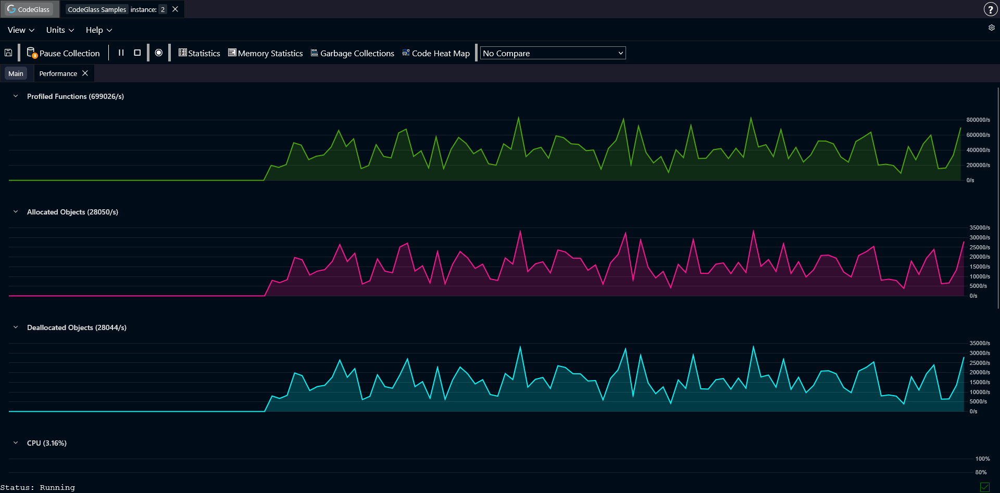

# Performance

The **Performance** view shows how runtime events are distributed over time.

Each chart represents a different type of event that CodeGlass tracks while your application is running.

This view can help you spot sudden changes in behavior. For example, you might see a spike in allocated objects, a large number of deallocations, or a sudden increase in function calls.

The view includes charts for:

- **Functions profiled**: number of functions that were executed.
- **Allocated objects**: number of objects allocated over time.
- **Deallocated objects**: number of objects freed over time.
- **CPU usage**: CPU usage of the process.
- **Memory used by the process**: total memory used by the running process.
- **Amount of active tasks**: number of tasks that were active.