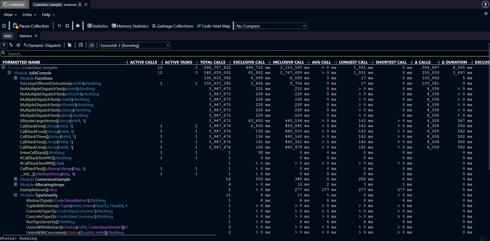

# Statistics

The **Statistics** view shows general statistics for all functions that were called during the run of your application.

Functions are grouped by the module where they are defined.

Double-clicking a module opens a new view that only shows the functions from that module.

Double-clicking a function opens the [Code Member](./codemember) view for that function.

You can also click on any column in the table to sort the data by that statistic.

## Toolbar

Above the table there is a toolbar with several options:

- **Filtering**: filters the data shown in the table. More about filters [here](../../concepts-and-features/filters).
- **Export to CSV**: generates a CSV file from the table. The file is automatically downloaded to your device.
- **Collapse All**: collapses all modules in the table.
- **Data Source**: select which [data source](../../concepts-and-features/datasources) the statistics should use.

## Search

The searchbar can be used to search for code members.  

Double-Clicking a search result will try to show the code member in the table.

Ctrl+Click on a search result will open the [Code Member](./codemember) view of that code member.

:::info
At present, searches are limited to code member names and do not include modules or types. Applied filters are also not taken into account.
:::

## Types of Statistics

The statistics table contains several columns with statistics about the functions and modules within the application.
Below, each type of statistic is explained for a function. The statistics for a module or process are the sum of the statistics of all functions within that module or process.

- **Active Calls**: The number of active calls at this very moment.
- **Active Tasks**: The number of active tasks at this very moment.
- **Total Calls**: The total number of calls that happened in the selected data source.
- **Exclusive Call**: The call duration of this function, excluding the time of the functions that get called inside of this function.
- **Inclusive Call**: The call duration of this function, including the time of the functions that get called inside of this function.
- **Average Call**: The average call duration of this function.
- **Longest Call**: The longest time a function took to execute.
- **Shortest Call**: The shortest time a function took to execute.
- **Δ Calls**: The amount of calls in the last second.
- **Δ Duration**: The sum of all call duration in the last second.
- **Exclusive Allocations**: The amount of allocations inside of this function, excluding the allocations of the functions that get called inside of this function.
- **Exclusive Deallocations**: The amount of deallocations inside of this function, excluding the allocations of the functions that get called inside of this function.
- **Δ Allocations**: The difference in exclusive allocated and deallocated objects.
- **Exclusive Allocated Bytes**: The amount of allocated bytes inside of this function, excluding the allocated bytes of the functions that get called inside of this function.
- **Exclusive Deallocated Bytes**: The amount of deallocated bytes inside of this function, excluding the allocated bytes of the functions that get called inside of this function.
- **Δ Allocated Bytes**: The difference in exclusive allocated and deallocated bytes.
- **Inclusive Allocations**: The amount of allocations inside of this function, and all other functions inside.
- **Inclusive Allocated Bytes**: The amount of allocated bytes inside of this function, and all other functions inside.

:::info
If [**memory profiling**](../general/settings#enable-memory-profiling) is turned off, the columns with memory statistics will not be shown.
:::