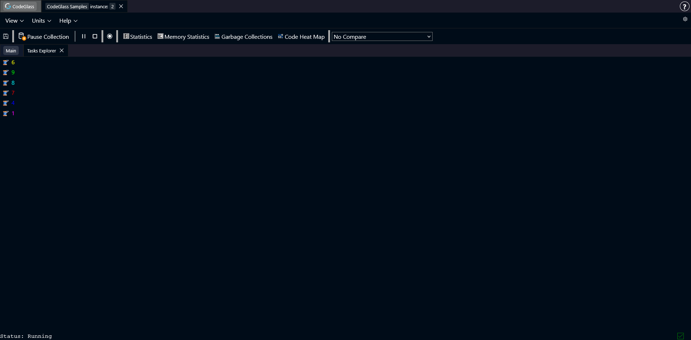
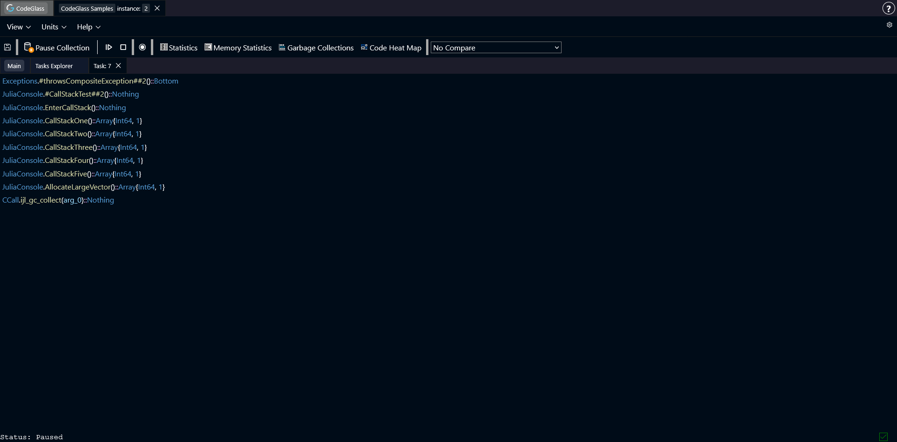

# Task Explorer

The **Task Explorer** shows a list of all tasks that were created during the run of your application.

Selecting a task from the list opens the [Task Detail](#task-detail) view.

## Task Detail

The **Task Detail** view shows the current call stack for the selected task.

The call stack grows downward, with each row representing a function call.

Double-clicking on a function in the stack opens the [Code Member](./codemember) view for that function.