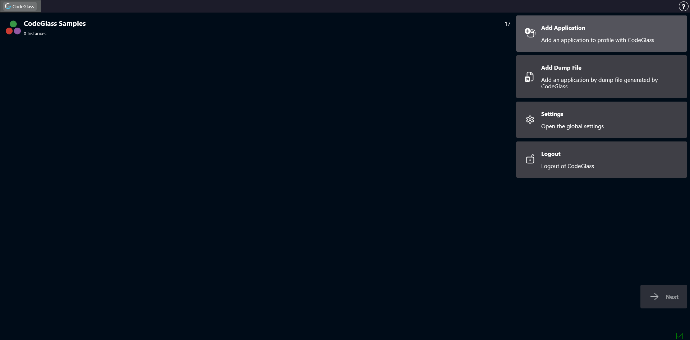
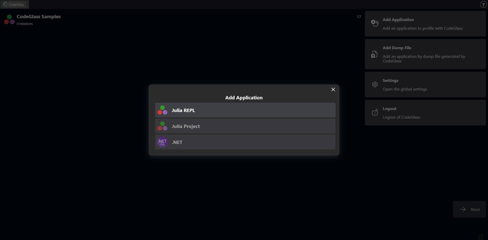
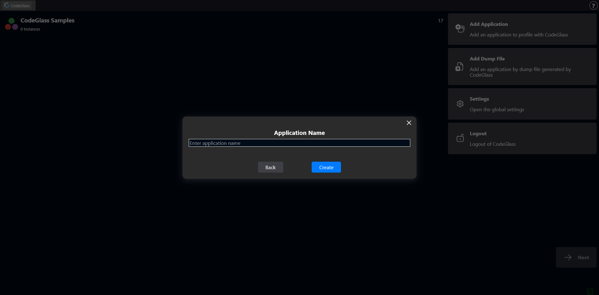
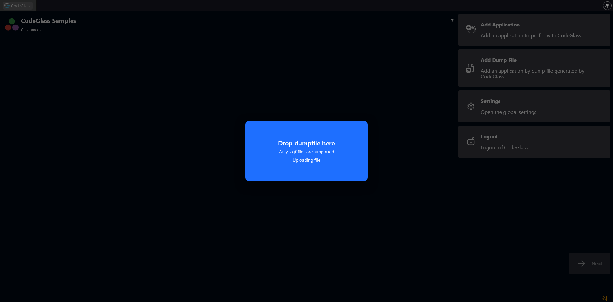
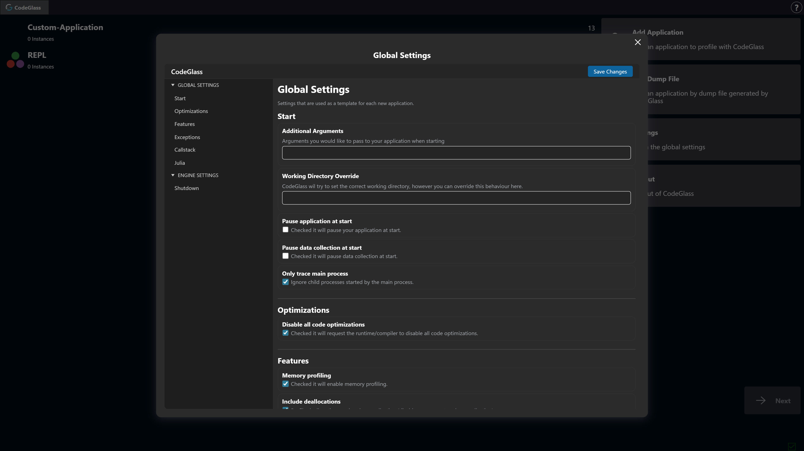

# Application List

After logging in, you arrive at the **Application List** screen. From here you can add applications or open existing ones.

In CodeGlass, an **application** is a configuration template. It allows you to define settings and group related instances of that application together.

On the left side of the screen you will find a list of all your applications.  
Double-clicking an application opens the [Application Instance List](./instance-list) page for that application.

## Sidebar

On the right side of the screen there is a sidebar with several buttons.

### Add Application

Clicking **Add Application** opens a short setup guide that helps you add a new application.

The first step is to select the **type of application** you want to create.  

:::info
Currently limited to Julia, see [intro](../../intro) for more information.
:::

After selecting the application type, enter a **name** for the application and press the **Create** button.  
This will create the new application and add it to your application list.

*If you have selected **Julia Project**, you will also have to enter the full path to the Project.toml.*

### Add Dump Files

CodeGlass can export all collected profiling data into [**dump file**](../../concepts-and-features/dumpfiles).  
You can upload these dump files by clicking this button.

Dump files can also be uploaded by **dragging and dropping them** onto any page in the [Client](../../intro#client).

### Settings

The [**Settings**](./settings) page will allow you to configure global CodeGlass settings.  
These settings act as a template for new applications. When a new application is created, it receives a copy of the settings defined here.

### Logout

Clicking **Logout** signs you out of CodeGlass and redirects you to the [login page](./login).