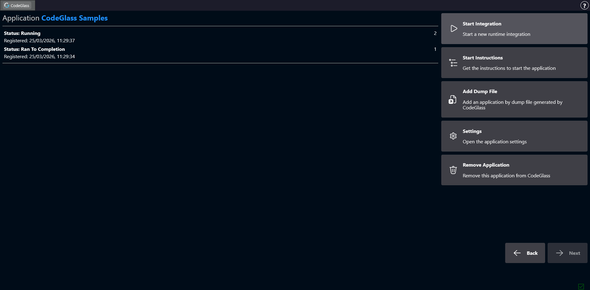
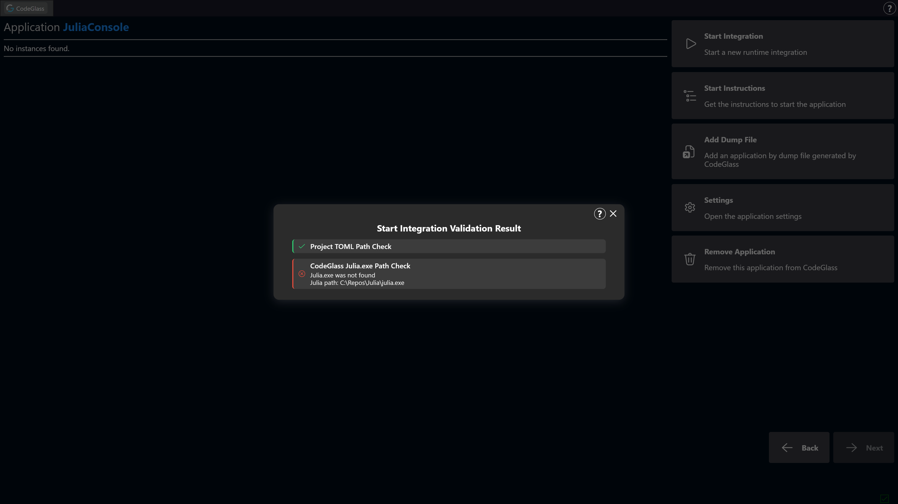
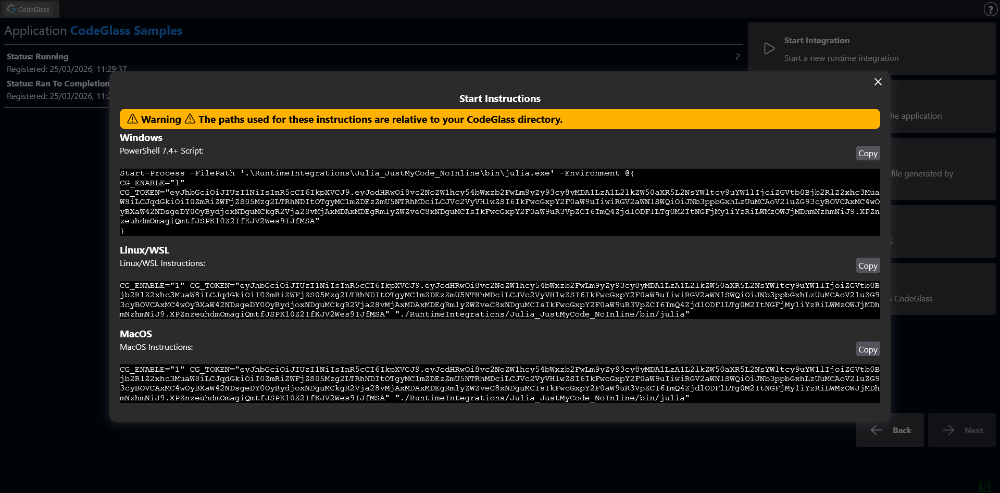
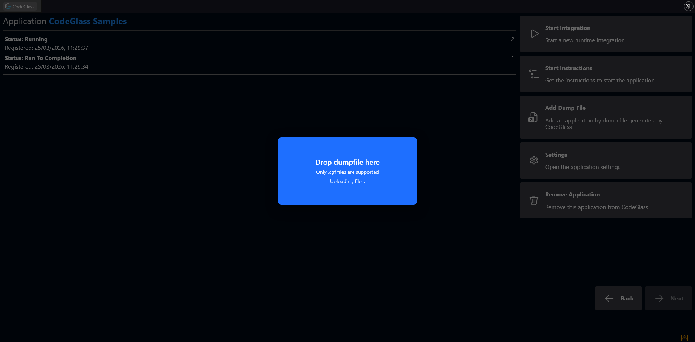
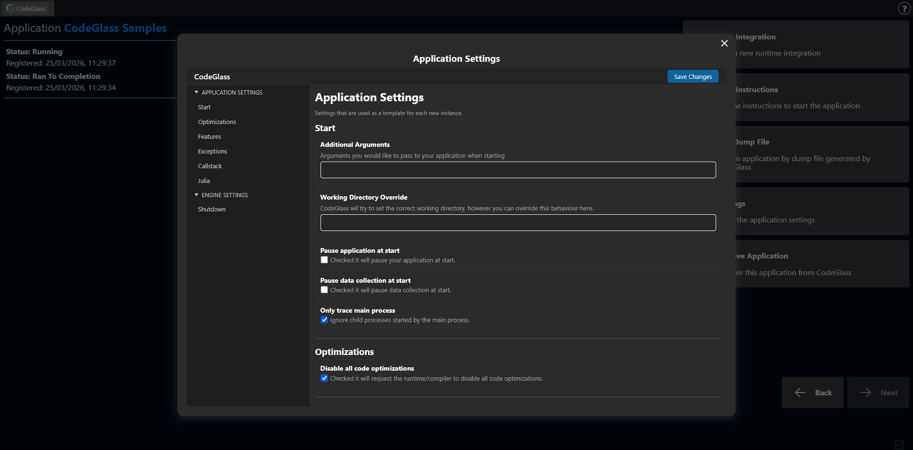

# Instance List

After selecting an application, you arrive at the **Instance List** screen. From here you can start new application instances or open existing ones.

An **instance** represents a single running process that is being profiled.

On the left side of the screen you will see a list of all instances that belong to this application.  
Double-clicking an instance opens the [Application Instance Screen](../app-instance/application-instance).

## Sidebar
### Start Integration
:::warning
Start Integration is right now only available for **Julia REPL** and **Julia Project** applications. Other application types can still use the [start instructions](#start-instructions).
:::

Clicking **Start Integration** starts the application using the configuration defined for this application.

For example, if the application was created using the **Julia REPL** template, this will start a new Julia REPL instance that you can use normally while CodeGlass profiles it.

In most cases, if starting a new integration fails, a message will be shown explaining why it failed. The most likely causes are that the Julia executable or the Project.toml file could not be found.

### Start Instructions

Clicking **Start Instructions** opens a popup containing commands for starting the application manually on different operating systems.

This feature is intended for advanced use cases where the **Start Integration** button does not fit the required workflow.

### Add Dump Files

CodeGlass can export all collected profiling data into [**dump files**](../../concepts-and-features/dumpfiles).

You can upload dump files by clicking this button. Dump files can also be uploaded by **dragging and dropping them** onto any page in the WebUI.

### Settings

The [**Settings**](./settings) button allows you to configure options specifically for this application.  
These settings are used as a template when a new instance of the application is started.

### Remove Application
:::info
To avoid problems when an agent is still attached, or when another user is viewing the data, the application is not deleted immediately. It is hidden from the UI and fully removed after the Engine is restarted.
:::

Clicking this button removes the application from CodeGlass.

### Back

Clicking **Back** returns to the [Application List](./application-list).