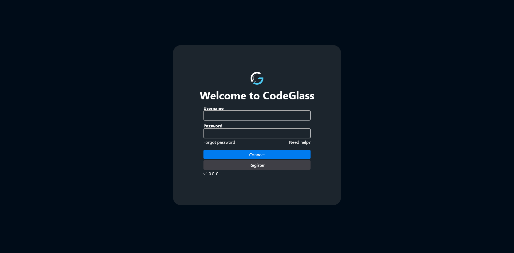

# Login

When you open the [CodeGlass Client](../../intro#client), the first screen you see is the **login page**. The page contains two fields:
- Username
- Password

## Username and Password
Enter the username and password that you used when creating your account.   

Don't have an account yet? Click the register button to go to the [register page](./register). 
Once you have registered an account, your password will be sent to your email and you can use that to login. **Don't forget to change your password immediately after receiving it!**

:::info
When you register an account, you automatically start a 14 day trail.

If you want to make an account with a paid license, please go to the [license](/license) page and purchase a license there. The email you use at checkout will be used to create your account.
:::

If you forgot your password, you can click the **Forgot password** link. This opens a new tab that redirects you to the LicenseSpring website. There you can enter your username and request a password reset link.

## Auto Login
After a successful login, CodeGlass will try to automatically log you in the next time you open or reload the page.

This automatic login works as long as the Engine is still running. If the Engine is stopped or restarted, you will need to log in again.
