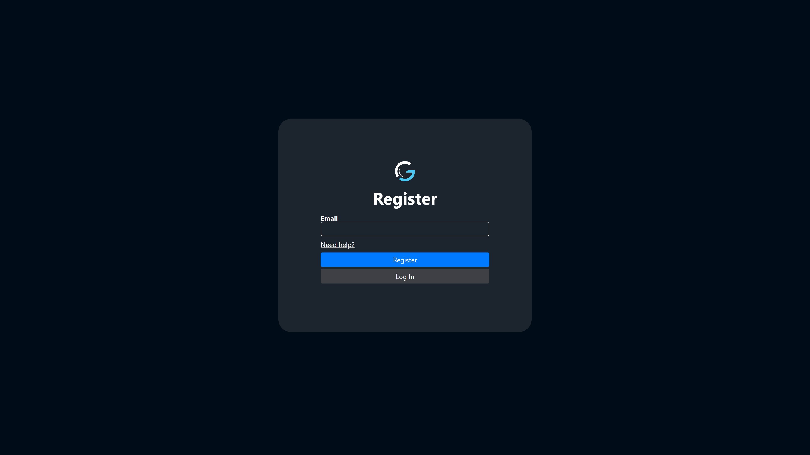

# Register

To register for the trial license of CodeGlass, you will need to enter your email address. Once you have successfully registered your account, your password will be sent to your email address. 
You will need this password when connecting to CodeGlass through the [login page](./login.md), to which you will be redirected after your registration is successful.

If you experience any trouble creating an account, feel free to [contact](/contact) us.

You do not need to enter any payment information when registering for the trial license!

:::info
When you register an account, you automatically start a 14 day trail.

If you want to make an account with a paid license, please go to the [license](/license) page and purchase a license there. The email you use at checkout will be used to create your account.
:::

:::info
The register page assumes the [CodeGlass Engine](../../intro#engine) is running on the same device as the [CodeGlass Client](../../intro#client). Registration won't work if that is not the case.
:::
