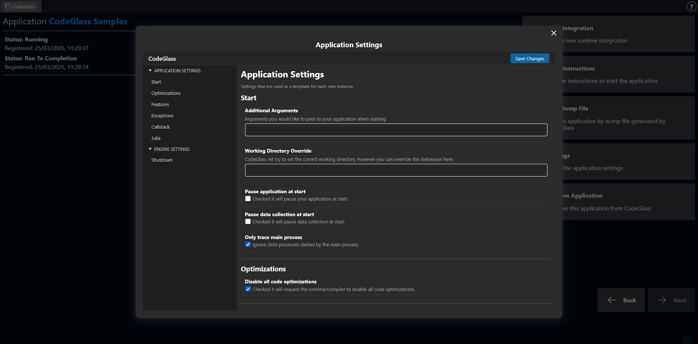

# Settings

In CodeGlass, there are three different levels of settings. First, you have the [global settings](./application-list#settings). These settings are used for every new application.

Next, the [application settings](./instance-list#settings) can be configured for each new instance created within that application.

Finally, you can view the [instance settings](../app-instance/application-instance#settings) for each instance. These settings cannot be changed, as they are defined at startup.

## Agent

### Start

#### Additional Arguments

Arguments that will be included in the [start instructions](./instance-list#start-instructions) of your application.

#### Working Directory Override

CodeGlass will try to set its correct working directory, but this can be overridden by defining the path of your working directory.

#### Pause Application At Start

When enabled, your application will be paused at the start.

You can continue the application through the [toolbar](../app-instance/application-instance#pause--continue-application) on the [instance screen](../app-instance/application-instance).

#### Pause Data Collection On Start

When enabled, the agent will start with [**data collection paused**](../../concepts-and-features/pause-data-collection). No data is sent to the Engine until data collection is manually enabled again.

You can enable data collection through the [toolbar](../app-instance/application-instance#pause--continue-data-collection) on the [instance screen](../app-instance/application-instance).

You can also enable data collection through the builtin [CodeGlass Julia package](../../languages/julia#pausecontinue-data-collection).

#### Only Trace Main Process

Languages such as Julia can spawn additional child processes, for example during precompilation.

By default, CodeGlass automatically profiles these child processes. This can slow down execution and create extra instances in the UI.

Enabling this option prevents CodeGlass from profiling child processes. If your application relies on them, leave this option disabled.

### Optimizations

#### Disable All Code Optimizations

When checked, it will disable all code optimizations done by the runtime/compiler.

*This option only works for .NET applications.*

### Features

#### Enable Memory Profiling

When enabled, the [Agent](../../intro#agent) will listen for memory allocation events and send this information to the Engine.

#### Enable Deallocation Profiling

When enabled, the agent will track garbage collection and deallocation events and send them to the Engine.

*This option is only available when Memory Profiling is enabled.*

*This option disables concurrent garbage collection for .NET applications.*

### Exceptions

#### Maximum Exceptions History

Exceptions can contain a lot of data. By setting this value, you tell CodeGlass how many exceptions it should keep stored in its history.

### Callstack

#### Maximum Of Stored Callstack History

By setting this value, you tell CodeGlass how many items it should keep stored in its callstack history.

#### Disable Realtime Renderers

When checked, it will stop the data collection for the realtime renderers. This will improve the speed at which CodeGlass can process data.

### Julia

#### Julia Profile Preset Type

CodeGlass allows you to start Julia with multiple different profiling presets.
These presets are described [here](../../languages/julia#julia-and-inlining).

## Engine

### Shutdown

#### Automatic Engine Shutdown

When enabled, the engine will shutdown when there are no active connections to agents and clients left.

### Executable Paths

#### Julia

The path to the CodeGlass Julia executable.   
This path will be used to start Julia applications from the [Engine](../../intro#engine). It is also used to determine the start instructions of a Julia application.

## Client
:::info
Client settings are still a Work In Progress.
:::