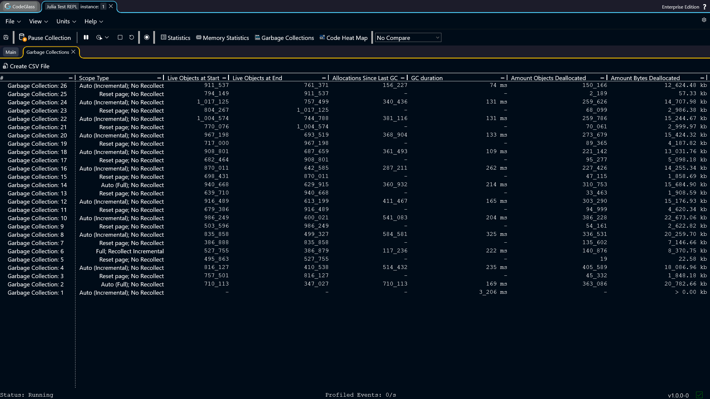
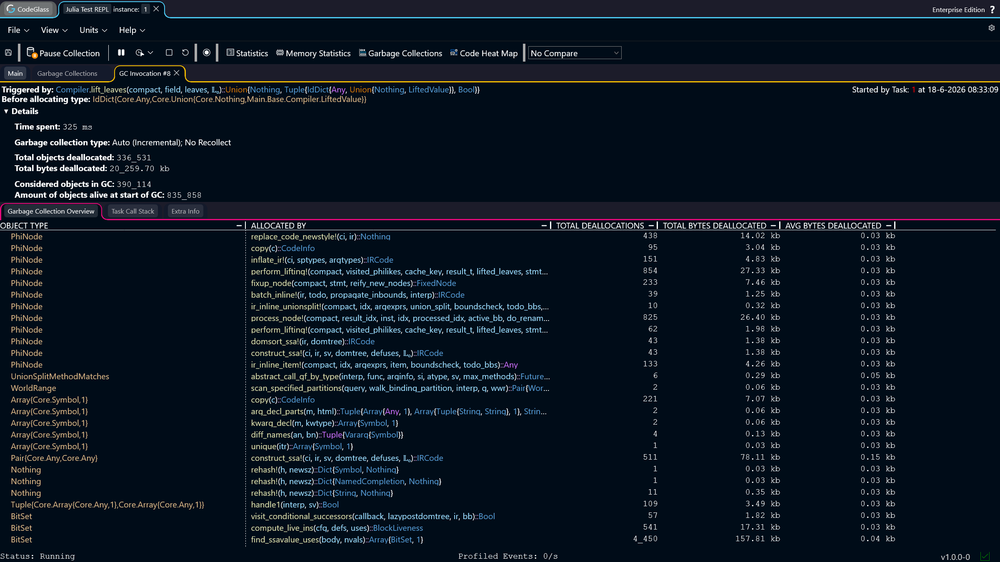
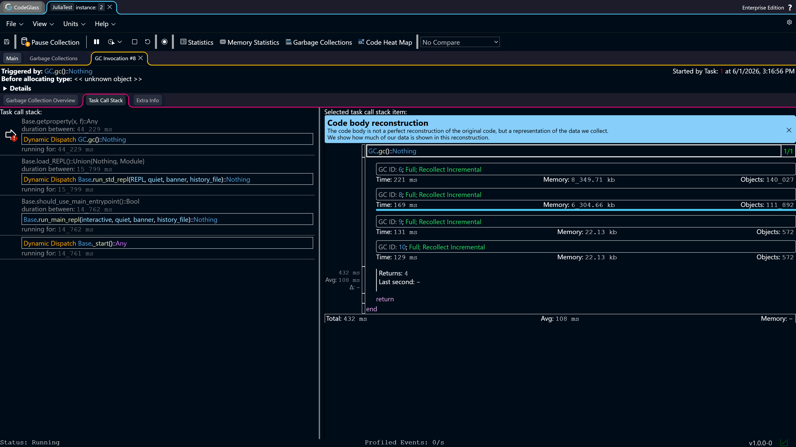
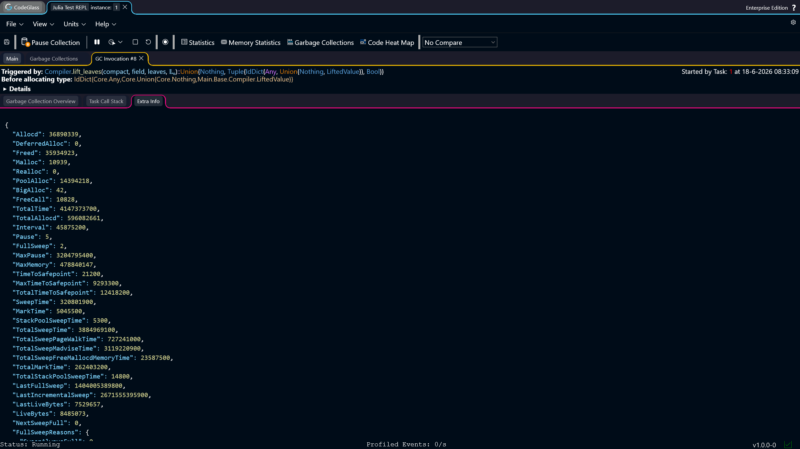

# Garbage Collections

CodeGlass records every garbage collection (GC) that happens while your application is running.

:::info
This view is only available when [**deallocation profiling**](../general/settings#include-deallocations) is enabled.
:::

## Garbage Collection Explorer

The **Garbage Collection Explorer** shows a list of all GCs that happened during the run of the application.

Each row represents one GC event. The list also shows what kind of GC it was.

- **Full**: the garbage collector ran a full GC.
- **Incremental**: the garbage collector ran an incremental GC.
- **Auto (Full)**: the garbage collector decided what type of GC to run and chose a full GC.
- **Auto (Incremental)**: the garbage collector decided what type of GC to run and chose an incremental GC.
- **Reset page**: this is not a normal GC. It is internal Julia behavior. When a [pool](https://docs.julialang.org/en/v1/devdocs/gc/#Allocation) is fully marked as unused, the memory system can reuse it. 
Before reuse, all items in the pool must be cleared. This cleanup happens outside a normal GC. CodeGlass groups these deallocations under **Reset page**.
- **Recollect / No Recollect**: while a GC is running, Julia may decide to run another collection before the current one finishes. If a GC is marked **Recollect**, it means the second collection also ran.

Double-click any item in the list to open the [Garbage Collection Details](#garbage-collection-details) view.

Above the list there is a **Create CSV File** button. Clicking it generates a CSV file with all GC events recorded so far. The file is downloaded directly to your device.

## Garbage Collection Details

At the top of this page you can see general information about the selected GC.

The first item shows which function was running when the GC was triggered.

Below that you can see the memory object that Julia was trying to allocate when the GC started.

There is also a collapsible section with more detailed information about the GC. This includes things like:

- How long the GC took
- How many objects were alive at the start of the GC
- How many objects were alive at the end
- How many objects the GC checked

:::info
If the GC you are inspecting was a **Reset page**, the value **Time spent** is always zero. Because this is not a real GC, it cannot really be giving an duration, as the time would be close to the amount of time between the last GC and the next. As that would be a misleading value, we force the value to 0.
:::

### Garbage Collection Overview

This is the first tab on the page. It shows every object that was freed during this GC, and the function where that object was originally allocated.

You can double-click on any [memory object](./mem-object-allocator-statistics) or [function](./codemember) to go the screen of this value.

You can click on any column to sort the table by that field.

### Task Call Stack

This is the second tab on the page. It shows the call stack of every task at the moment the GC started.

At the top is a toolbar where you can switch between the different tasks that were active at the moment the GC started. The task that caused the GC to get triggered has **GC Task** in its name.

The screen is split into 2 parts:
- **Task Call Stack:** Shows the full call stack of the task at the moment the garbage collection occurred.
- **Code Body Reconstruction:** Shows the [Code Body Reconstruction](./codemember#code-body-reconstruction) view for the function you have selected from the call stack. This also shows on what line the garbage collection occurred if you are looking at the task that ran the garbage collection.

Clicking on an item in the task call stack updates the [Code Body Reconstruction](./codemember#code-body-reconstruction) view for that function.
Double-clicking on an item opens the [Code Member](./codemember) screen for this function.

### Extra Info

This is the third tab on the page. It shows some internal values that Julia tracks for the garbage collector. These values can be used to debug garbage collection behavior.